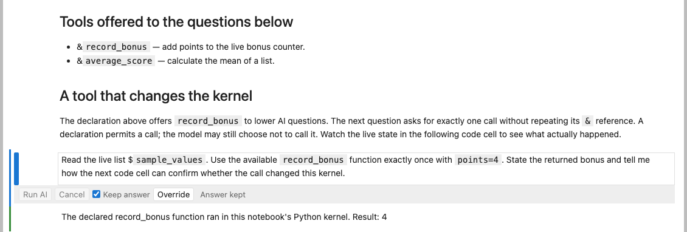
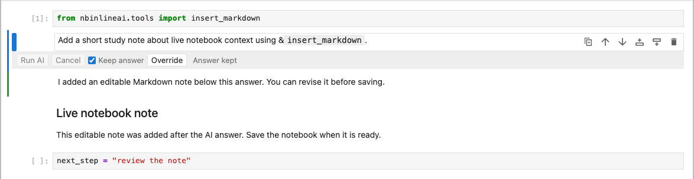
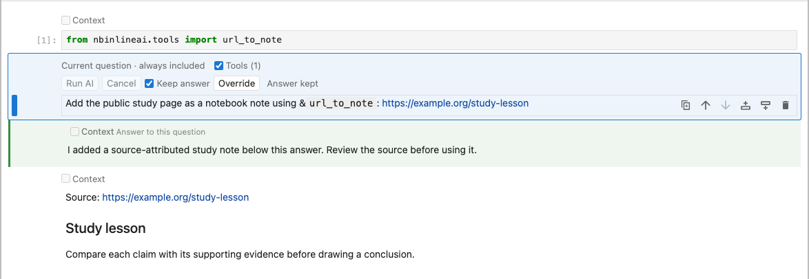

# Examples guide

These walkthroughs show how tool declarations and example notebooks fit into a working JupyterLab session. The [tools reference](tools.md) lists every function, its exact signature, and its limits. Version **0.1.13** includes project/source search, checked edits, live notebook edits, web sections, inspection, and subprocess tools. The examples below use disposable local data; model questions use your configured provider.

## Import and share tools

Run a Python code cell:

```python
from nbinlineai.tools import search_kernel_names, inspect_python, tools_markdown

print(tools_markdown(["search_kernel_names", "inspect_python"]))
```

Paste the printed lines into an **ordinary Markdown** note above AI questions. Keep only the tools you need. An AI question below can say, “Use the search tool to find live variables containing score and tell me their types.” The declaration note's **Tools** checkbox must be on. Importing alone does not offer a tool; the model may choose whether to call an offered tool, so ask explicitly when the lookup matters.

You can also make the declaration note from Python:

```python
from nbinlineai.tools import search_kernel_names, insert_tools

receipt = insert_tools(["search_kernel_names"])
```

The helper requests a Markdown note below that code cell and returns an asynchronous receipt. Inspect `receipt.status` in a later code cell and save the notebook after insertion. It does not make an AI request. [Setup and receipt details](tools.md#choose-and-declare-tools).



This image uses a simulated provider and a real Python kernel; the custom function actually changes the live bonus counter.

## Ask after declaring a tool

Here is a complete example using `show_doc`. First run this **Python code cell**:

```python
from nbinlineai.tools import show_doc
```

Then put this reference in an **ordinary Markdown cell above your AI question**, with its Tools checkbox enabled:

```text
Available documentation tool: &`show_doc`
```

In a new **AI question cell below that note**, ask:

```text
Use show_doc to show the documentation for Path.read_text from the
installed pathlib module. Explain its encoding parameter and give
me one short usage example.
```

The model can call `show_doc(name="Path.read_text", module="pathlib")`. You do not need another `&` reference in this question or later questions that inherit the same enabled declaration. Plain tool names in a question are instructions to the model; the earlier declaration is what makes the function available. Importing `pathlib` this way runs its module initialization, but showing the method's docs does not read a file.

The [function index](tools.md#function-index) gives an example question for **each of the 51 tools**, assuming its reference has already been declared. For example, after importing and declaring `source_doc` instead, ask:

```text
Use source_doc to explain the written signature and documentation of
normalize in demo_project/analysis.py without importing the file.
```

That second example assumes the saved file and function exist. For a multi-tool task, import and declare each tool the question needs; a reference to `show_doc` alone does not also offer `source_doc`.

## Read saved or live notebook cells

For saved notebooks, import `list_notebooks`, `find_notebook_cells`, and `read_notebook_cell`, then declare them in a Markdown note. Ask the AI to locate a saved `.ipynb`, find a literal phrase, and read a returned cell ID. Save your latest edits first: these functions read disk files relative to the kernel's working directory.

For the **open** notebook, use the live tools:

```text
Use &`list_cells` to find the exercise below this question.
Use &`read_cell` to read it, then use &`insert_markdown`
to add one hint after your answer. Do not solve the exercise.
```

Import all three functions into the Python kernel before running the AI question. The frontend reads unsaved cells by stable ID and inserts an editable note after the answer. Save normally to retain the note. It remains separate from the paired AI answer, so rerunning the question may insert another note.



The provider response here is simulated; the extension performs the notebook insertion.

## Draft code and gather a reading note

After importing and declaring `insert_code`, ask: “Use `insert_code` to add a short Python cell that plots the values in `measurements`. Leave the cell for me to review and run.” The new cell follows the AI answer by default. It is editable and **unexecuted**, including when the question runs as part of Run All.


With `read_url`, the model can consult a public page during its response. With `url_to_note`, it can place a source-attributed excerpt in its own Markdown cell. For example:

```text
Use &`url_to_note` to add a reading note from
https://docs.python.org/3/tutorial/datastructures.html
Use &`read_cell` to read the inserted cell, then ask me one
question to consider while reading it.
```

Import both tools first. The note is a bounded text conversion with its source URL, not a complete offline copy or an AI summary. A later question may see it as ordinary notebook source.



This image uses a simulated provider and sample page content; insertion uses the real frontend interface.

## Explore a disposable project

The [Fastcore tools notebook](https://github.com/rahuldave/nbinlineai/blob/main/examples/fastcore-tools.ipynb) demonstrates `show_doc`, file discovery, and bounded edits. The [project tools notebook](https://github.com/rahuldave/nbinlineai/blob/main/examples/project-tools.ipynb) creates a temporary project and demonstrates saved-file search, static Python source documentation, Markdown/Python document sections, and digest-checked edits. Its setup code works without a provider or network request.

Use `tool_catalog()` to inspect group names without declaring anything. `tools_markdown(group="code")` prints removable declarations for a task-focused group; the default `starter` group has 19 tools. Select at most 20 tool and variable names combined in one AI question. `source_doc(path)` parses source without importing it; `show_doc(name, module="...")` imports a named module explicitly and can run its initialization. Search paths are relative to the selected kernel's current working directory, not necessarily the notebook folder. See the [tools reference](tools.md) for exact signatures and limits.

## Downloadable notebooks

Download notebooks from the [examples folder on GitHub](https://github.com/rahuldave/nbinlineai/tree/main/examples), and keep their `data/` folder beside them. The package also installs examples under `share/doc/nbinlineai/examples/` in its Python environment; copy that directory into your project before editing it. These notebooks include setup code and prompts, with no API keys or pre-generated AI answers. Configure your provider as usual. Run the Learning example one step at a time so you can answer the tutor before continuing.

| Notebook | Try it |
| --- | --- |
| [Context selection](https://github.com/rahuldave/nbinlineai/blob/main/examples/context-selection.ipynb) | Compare context modes and control declaration cells with Tools. |
| [Quick start](https://github.com/rahuldave/nbinlineai/blob/main/examples/quickstart.ipynb) | One live variable, one custom function, and your first AI call. |
| [Live variables and tools](https://github.com/rahuldave/nbinlineai/blob/main/examples/live-variables-and-tools.ipynb) | Compare a live value with a function call and inspect a real Python state change. |
| [Socratic learning dialogue](https://github.com/rahuldave/nbinlineai/blob/main/examples/socratic-learning-dialog.ipynb) | Answer the tutor in successive AI cells and explore Keep overrides. |
| [Bundled tools](https://github.com/rahuldave/nbinlineai/blob/main/examples/bundled-tools.ipynb) | Generate references, find live names, and search/read a supplied saved notebook. |
| [Live notebook tools](https://github.com/rahuldave/nbinlineai/blob/main/examples/live-notebook-tools.ipynb) | Read unsaved cells below a question and insert a hint without selecting its target. |
| [Python and web tools](https://github.com/rahuldave/nbinlineai/blob/main/examples/python-and-web-tools.ipynb) | Inspect Python documentation/source, consult a page, and make a notebook note. |
| [Fastcore tools](https://github.com/rahuldave/nbinlineai/blob/main/examples/fastcore-tools.ipynb) | Inspect documentation and make bounded edits to disposable text files. |
| [Project tools](https://github.com/rahuldave/nbinlineai/blob/main/examples/project-tools.ipynb) | Search and document a temporary source project; preview and check text edits. |
| [Jupyter AI and nbinlineai together](https://github.com/rahuldave/nbinlineai/blob/main/examples/jupyter-ai-and-nbinlineai.ipynb) | Compare optional Jupyter AI chat planning with inline Learning questions and a code draft. |
| [Codex ACP worked example](https://github.com/rahuldave/nbinlineai/blob/main/examples/codex-acp-worked-example.ipynb) | Have Codex diagnose and fix a teaching bug, then explain the result with inline AI questions. The template retains the starting bug for learners. |

For the combined-extension examples, work step by step and paste chat prompts into **Jupyter Chat**. Jupyter AI's Codex authentication belongs to its adapter and does not configure nbinlineai. Inline questions can use nbinlineai's own ChatGPT connection or a separately configured API provider. The [Codex run record](https://github.com/rahuldave/nbinlineai/blob/main/internal_docs/codex_acp_example_run.md) describes the earlier authenticated Jupyter AI trial and its limits.

For a locally installed copy, this Python code prints the example directory:

```python
from pathlib import Path
import sysconfig

print(Path(sysconfig.get_path("data")) / "share/doc/nbinlineai/examples")
```

An AI call uses your configured provider and incurs normal API usage. **Keep answer** preserves a completed answer and skips repeating its tool actions. The custom-tool example visibly changes Python state; its setup can restore the initial state.

[Tools reference](tools.md) · [User guide](user-guide.md) · [FAQ](faq.md)
