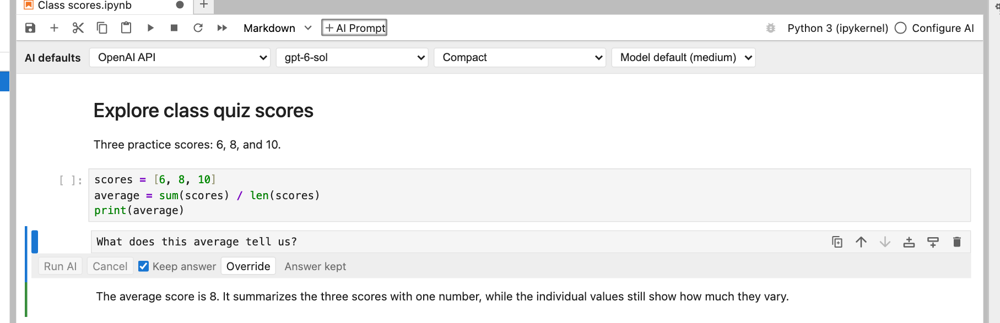

# AI conversations inside your notebook

**nbinlineai** adds AI prompt cells to JupyterLab. Ask about the code and notes above a cell, refer to live Python values, and let a model call functions you explicitly name. Prompts and answers stay in the notebook as readable Markdown.

## Start here

1. Install **nbinlineai** from JupyterLab's Extension Manager, then restart the whole Jupyter server.
2. Open a Python notebook and use **Configure AI** to save your OpenAI or Anthropic API key.
3. Choose your notebook's model and style in **AI defaults**.
4. Click **+ AI Prompt**, write a question, and press **Shift+Enter**.

For a uv project:

```bash
uv add jupyterlab nbinlineai
uv run jupyter lab
```



## Read more

| Guide | What you will find |
| --- | --- |
| [User guide](user-guide.md) | Illustrated setup, notebook defaults, styles, thinking effort, editing and rerunning, context, variables, tools, and troubleshooting. |
| [Architecture](architecture.md) | How the browser, Jupyter Server, notebook kernel, and model provider work together; saved data and tool schemas. |
| [Development](development.md) | Set up with uv, build the extension, run the tests, and maintain these docs. |

## In version 0.1.4

- Set provider, model, style, and effort once per notebook, with optional cell overrides.
- Edit the built-in **Compact**, **Full**, and **Learning** instructions in Configure AI.
- Leave **Keep answer** on to step through completed AI prompts without another request. Turn it off to rerun a prompt.

This version supports OpenAI and Anthropic API keys. API usage is billed by the provider; ChatGPT subscription sign-in is not included.

[Install from PyPI](https://pypi.org/project/nbinlineai/) · [Source on GitHub](https://github.com/rahuldave/nbinlineai) · [Report an issue](https://github.com/rahuldave/nbinlineai/issues)

Licensed under GPL-3.0-only, matching ai-jup.
