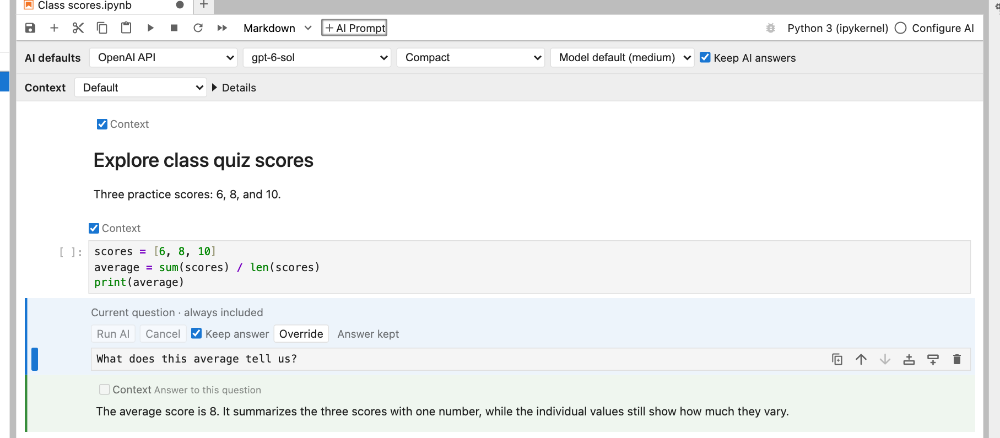

# AI questions inside your notebook

**nbinlineai** adds editable AI questions and paired answers to JupyterLab notebooks. Ask about nearby code, refer to a live Python value, or let the model call a function you explicitly offer. The conversation stays as readable Markdown when you save the notebook.

## Start here

1. Install **nbinlineai** in the environment running JupyterLab and restart the whole server. In a uv project, run `uv add jupyterlab nbinlineai`, then `uv run jupyter lab`.
2. Open a Python notebook. Use **Configure AI** to sign in with ChatGPT or save an OpenAI or Anthropic API key; choose the notebook's model in **AI defaults**.
3. Click **+ AI Prompt**, write a question, and press **Shift+Enter**. The answer appears in a separate Markdown cell.

The [setup chapter](manual/setup.md) walks through installation and connections. The [user guide](user-guide.md) explains prompts, context, tools, editing, Run All, and saved notebook data.

## Learn by doing

The [notebook gallery](examples.md) has walkthroughs and complete tool-catalog notebooks. Each tool in the [Tool catalog](tools.md) links to a concrete normal Python or JupyterLab action and an AI question. The examples use disposable inputs; copy a notebook before editing it.

A tool declaration gives the model access to a selected function, but it does not make the function run by itself. Browser-media calls add one more step: a direct Python call returns a mutable receipt before browser work finishes, while an AI call returns an initial snapshot. Inspect the receipt later, or ask `operation_status` in a later AI turn, before using a source ID, media result, or saved path. [Browser media operations](browser-media-foundation.md) shows the pattern.

## Find a topic

| Guide | What it covers |
| --- | --- |
| [User guide](user-guide.md) | A reading path through the eight manual chapters. |
| [Tool catalog](tools.md) | Function signatures, bounds, and exact notebook demonstrations. |
| [Notebook examples](examples.md) | Walkthroughs, complete catalog notebooks, and how to use their results. |
| [FAQ](faq.md) | Common questions about context, Keep answer, tools, and execution. |
| [Architecture](architecture.md) | The browser, Jupyter server, notebook kernel, and model request boundary. |
| [Prior art](prior-art.md) | The ideas behind this notebook workflow. |
| [Development](development.md) | Contributor setup and verification commands. |

Questions and answers remain in the notebook. API keys stay in the server user's configuration, and a confirmed image attaches only to the question you choose. [Saved notebooks and privacy](manual/saving-and-privacy.md) explains these boundaries.
