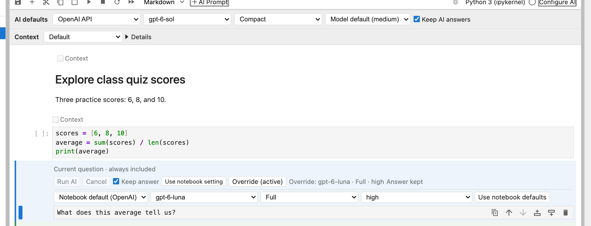

# Models, styles, and effort

[Manual](../user-guide.md) · [Previous: Write and run AI questions](prompts.md) · [Next: Edit, rerun, and run notebooks](editing-and-running.md)

## Provider and model choices

- An API provider without a configured key is marked **API key required** and cannot be selected. A disconnected ChatGPT selection remains visible with its own unavailable message.
- In current Git source, **Configure AI → Defaults → Default connection for new notebooks** sets your user preference. PyPI 0.1.14 shows this control in its single scrolling dialog. If only one API provider is configured, a notebook without saved AI defaults starts with that available provider unless your preference is ChatGPT. To change an existing notebook, use its **AI defaults** row below the notebook toolbar.
- Choose a listed model or **Default**. **Custom model…** is for API connections to enter another model ID supported by that provider; ChatGPT offers only supported models available to the connected account.
- Bundled model defaults are `gpt-6-sol` for OpenAI and `claude-sonnet-5` for Anthropic. A model default you set in JupyterLab's nbinlineai settings takes precedence.
- API listed models are suggestions, not a live account-access check. ChatGPT lists runtime-supported models available to the connected account and their reasoning efforts; an unavailable saved model or effort is kept and cannot run until you change it.
- Notebook defaults are stored in notebook metadata. Inherited cells use those choices without saving separate copies in every prompt.
- **Override** exposes choices for an individual cell. Its provider starts at **Notebook default**; selecting a model alone does not pin the cell to the current provider. Choose a provider there only when this question should use a different connection. **Use notebook defaults** removes the cell's provider, model, style, and effort overrides. Cells from earlier versions retain their saved provider/model choices until you do this.
- A saved provider/model is not silently replaced when a key or ChatGPT connection changes. Changing providers clears the previous provider's model choice. A missing connection produces setup guidance until you restore it or select another provider yourself.


Here the cell keeps **Notebook default (OpenAI)** for its connection while choosing its own model, style, and effort. If the notebook's connection changes, this cell follows it; review any saved model choice for the new connection.



## Response styles

Use the notebook's **AI defaults** row to choose how the model should answer, or use **Override** for an individual prompt:

| Style | What to expect |
| --- | --- |
| **Compact** | Very succinct answers with minimal explanation. Code is allowed when helpful, in fenced Markdown blocks. This is the default. |
| **Full** | Detailed explanations, reasoning, examples, and code when helpful. Code is placed in fenced Markdown blocks. |
| **Learning** | A Socratic tutor that asks focused questions, responds to your attempts, and helps you work out the solution. It is instructed not to provide complete solutions or substantial code; code hints are limited to 3 lines in total per response. It may suggest documentation. |

The notebook's style choice is saved in its `.ipynb` metadata. A cell uses this choice unless it has an explicit override. Reruns use the current effective choices; changing defaults does not rewrite saved answers or alter a response already in progress. JupyterLab user preferences provide initial defaults for notebooks without saved choices.

## Edit the style instructions

Open **Configure AI → Defaults** and expand the style-instruction editors. In PyPI 0.1.14, they are in the single scrolling dialog. Compact, Full, and Learning start with our bundled instructions. Edit a style's text and click **Save** to use your own wording. **Reset** removes that override and restores the current bundled instructions. Empty instructions are rejected; use Reset instead. Each custom instruction can contain at most 8,000 characters.

Custom instruction text is stored in JupyterLab user settings, outside the notebook. Sharing an `.ipynb` shares its style choice, but not your personal rewritten instructions. A recipient uses their own instructions for that style. Notebook context and tool-handling instructions remain managed by the extension.


If a save cannot be confirmed, nbinlineai keeps using the last confirmed instructions and offers a settings Retry to check what was saved.

## Thinking effort

Choose effort beside the model in the notebook defaults. **Model default** omits the override and lets the provider choose. Other available levels depend on the model; the picker only offers known supported choices. Individual cells can override effort when needed.

| Model | Supported effort choices | Provider default |
| --- | --- | --- |
| GPT-6 Sol / Luna | None, Low, Medium, High, Extra high, Max | Medium |
| GPT-6 Astra | Low, Medium, High, Extra high, Max | Provider-selected |
| Claude Sonnet 5 / Fable 5.1 | Low, Medium, High, Extra high, Max | High |
| Claude Opus 5.5 | Low, Medium, High, Extra high, Max | Medium |
| Claude Haiku 4.5 / unknown custom model IDs | Model default only in this version | Provider-selected |

Effort controls how much work the model puts into the answer. Higher settings can use more tokens and take longer. **Style controls how the answer is presented**: you can use Compact with high effort, or Learning with low effort. nbinlineai displays the answer rather than internal thinking content.

The mappings use OpenAI's `reasoning.effort` and Anthropic's `output_config.effort` with adaptive thinking where supported. Claude Haiku's older manual thinking budget is a different control and is not exposed here. See [OpenAI reasoning](https://developers.openai.com/api/docs/guides/reasoning) and [Claude effort](https://platform.claude.com/docs/en/build-with-claude/effort).

These are instructions to the language model, not output filters. Learning mode guides tutoring behavior; it is not a technical guarantee that the model can never reveal a solution.

## A Learning conversation

1. Choose **Learning** in the notebook's AI defaults.
2. Insert an AI Prompt below the code or notes you are studying. Ask, for example: `Help me understand this loop. Ask me questions so I can figure it out.`
3. Read the tutor's question.
4. Select the tutor's answer cell and click **+ AI Prompt** to create a new prompt below it.
5. Write your answer or attempt and run that new prompt. The AI receives the preceding conversation and responds to your reasoning.
6. Continue with another AI prompt below each answer. You can add ordinary code or Markdown cells between exchanges to try an idea or explain your thinking.

For example:

```text
You:   Help me understand why this loop skips an item.
Tutor: What happens to the remaining indices when an item is removed?
You:   I think the next item moves into the current index.
Tutor: What index does the loop visit next, and which item might that miss?
```

Each “You” line is a new AI Prompt cell, and each tutor reply is its paired answer. Turn off Keep answer, edit, and rerun an old prompt when you want to replace that exchange; create a new prompt when you want to continue the conversation.


[Manual](../user-guide.md) · [Previous: Write and run AI questions](prompts.md) · [Next: Edit, rerun, and run notebooks](editing-and-running.md)
