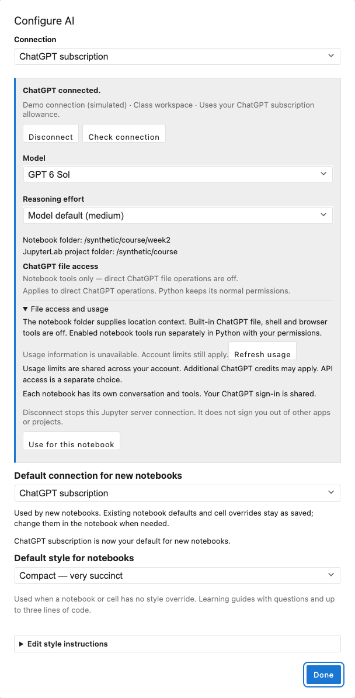

# Install and connect

[Manual](../user-guide.md) · [Next: Write and run AI questions](prompts.md)

You need JupyterLab 4.2 or newer and Python 3.12 or newer. Use a ChatGPT subscription or an OpenAI or Anthropic **API key**.

1. Open JupyterLab's **Extension Manager**, search for **nbinlineai**, and install it.
2. Save your notebooks and **stop and restart the whole Jupyter server**. Refreshing the browser or restarting a notebook kernel is insufficient.
3. Open a Python notebook. Click **Configure AI** at the far right of the notebook toolbar, beside the kernel name.
4. In **Configure AI**, choose **ChatGPT subscription** and sign in, or choose an API connection, paste its key, and click **Save**. An API provider should show **Saved on this computer**.
5. For ChatGPT, choose an available model and effort, then click **Use for this notebook**. For an API connection, use the notebook's **AI defaults** row below its toolbar to choose provider and model. To choose a user preference for notebooks without saved defaults, use **Default connection for new notebooks** in Configure AI. Compact is the starting style; Model default lets the provider choose thinking effort.



For a project managed by uv, install and launch with:

```bash
uv add jupyterlab nbinlineai
uv run jupyter lab
```

Install the extension in the environment running JupyterLab. Installing it only in a different notebook kernel's environment will not load its server component.

ChatGPT uses your account allowance, which has limits and may use additional credits. API requests are billed separately by their provider. The extension never switches from a selected ChatGPT connection to a paid API connection without your choice.

## ChatGPT connection

**Sign in with ChatGPT** opens the account sign-in page. If its browser callback cannot reach the Jupyter server, choose **Use device code** and follow the displayed link and code. The connection shows the account, runtime-supported models available to it and their reasoning efforts, and usage information when available. An unavailable usage display does not mean unlimited usage. No separate Codex app, command, Node installation, or API key is needed for this connection.

For device-code sign-in, leave **Configure AI** open, choose **Use device code**, then open **Open device sign-in page** in your usual browser profile and enter the code shown in the dialog. If an embedded or automated browser meets a sign-in challenge, you can copy that link into your normal browser, such as Safari; this does not require moving the notebook there. Finish the account sign-in, return to the notebook, and use **Check connection** if the status has not updated. **Cancel sign-in** stops a pending attempt. A completed sign-in only connects the account; choose a supported model and **Use for this notebook** to save the notebook default.

If device-code login is disabled, enable it in your personal ChatGPT security settings, or ask your workspace administrator to enable it in workspace permissions. See [OpenAI's authentication guide](https://learn.chatgpt.com/docs/auth).

Signing in, checking status, and opening Configure AI do not change the notebook. **Use for this notebook** explicitly saves the ChatGPT connection, model, and effort as notebook defaults. Setting **Default connection for new notebooks** saves a user preference; it does not replace an existing notebook's saved choice. A question with an explicit cell provider override keeps that choice until you select **Notebook default** in the cell's Override controls or click **Use notebook defaults**. Each notebook has its own questions, context, declared tools, and Keep choices; your ChatGPT sign-in is shared. If sign-in expires, a model becomes unavailable, or usage is limited, your saved selection remains visible and requests pause until you reconnect or deliberately change it. **Disconnect** stops this Jupyter server's connection without signing you out of other apps or projects.

The panel shows the notebook folder as location context and the JupyterLab project folder. **ChatGPT file access** currently reads **Notebook tools only**: built-in ChatGPT file, shell, and browser actions are disabled. Enabled notebook tools run separately in Python with the kernel user's normal permissions, including its own working directory. The displayed folder does not confine Python or promise that the kernel has changed directory.

[Manual](../user-guide.md) · [Next: Write and run AI questions](prompts.md)
