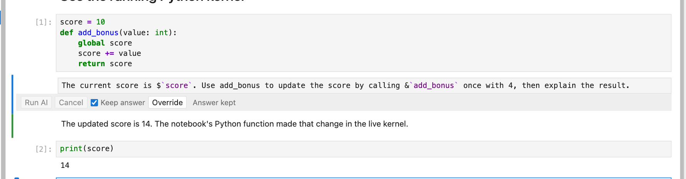

# Live values and tools

[Manual](../user-guide.md) · [Previous: Choose notebook context](context-selection.md) · [Next: Saved notebooks and privacy](saving-and-privacy.md)

Run this ordinary Python cell first:

```python
score = 7

def add_bonus(value: int) -> int:
    """Return the score plus a bonus."""
    return score + value
```

Then put this in an AI Prompt cell:

```text
What is $`score`? Call &`add_bonus` with value 3, then explain the result.
```

| Syntax | Meaning |
| --- | --- |
| ``$`score` `` | Read the live value of `score` from the notebook's Python kernel and include its text representation in this request. |
| ``&`add_bonus` `` | Make `add_bonus` available as a function tool for this request. |

The screenshot below shows a variant that changes the live variable: its function adds 4 to a score of 10, then a normal Python cell confirms that `score` is now 14.



References must be simple Python names, not expressions such as `df.head()` or `obj.attribute`. Assign an expression to a named variable first if you want to reference its result.

Functions named with `&` in the current question or any ordinary Markdown/AI question above it are exposed as tools. The extension reads their current signatures and docstrings, describes them to the model, checks returned arguments, and calls them in the same notebook kernel. These are real function calls and can change variables or perform other actions implemented by your function. A reference permits a call; it does not guarantee that the model will choose to make one.

From **0.1.7**, declare tools once in a Markdown note and use them in questions below. Several notes can add different tools; duplicate names are registered once. Enabled declarations remain effective even when their text is unchecked or omitted for space; the separate Tools checkbox withdraws declarations from that cell. AI answers, code, raw cells, and cells below the question do not register tools. Eligible Markdown is scanned even inside quotations and fenced code blocks. Live `$` variable interpolation remains limited to the **current question**.

Version 0.1.13 includes 51 optional tools for live and saved notebook cells, project search, source and Python inspection, public pages, checked text edits, and bounded subprocesses. Import `tool_catalog` from `nbinlineai.tools`, then run `print(tool_catalog())` to see groups without offering anything. Import the functions you want, then run `print(tools_markdown([...]))` or choose a group with `tools_markdown(group="code")`; copy and shorten the references in a Markdown note above your questions. The default starter group has 19 tools, and a request permits 20 distinct tool and variable names combined. See the [tools reference](../tools.md) and [examples guide](../examples.md).

Live notebook tools stay attached to the notebook that started the request. They can explicitly read cells below your prompt; this is separate from the text chosen by the Context controls. `insert_markdown` and `url_to_note` create ordinary Markdown notes after the answer by default; `insert_code` inserts an ordinary code cell without running it. Save the notebook to preserve them. Rerunning a prompt can insert another cell, and cancelling does not undo a cell already inserted. The live-cell tools that use the frontend require an AI request; their Python stubs cannot operate the browser directly.

Use normal synchronous Python functions with named parameters, simple type annotations, and a helpful docstring. Async functions and signatures using positional-only parameters, `*args`, or `**kwargs` are not supported. Function output sent back to the model combines captured standard output and the return value's text representation.

If a live value seems wrong, run its defining cell again. Reading code source does not execute it or synchronize it with the kernel.

[Manual](../user-guide.md) · [Previous: Choose notebook context](context-selection.md) · [Next: Saved notebooks and privacy](saving-and-privacy.md)
