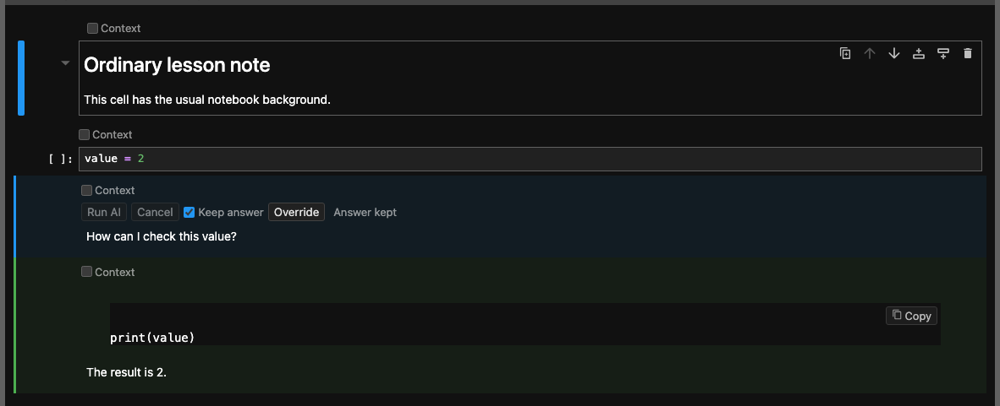
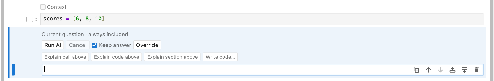
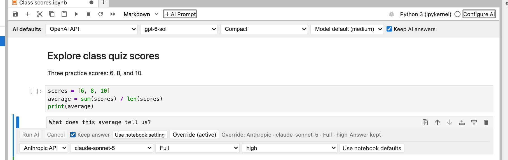
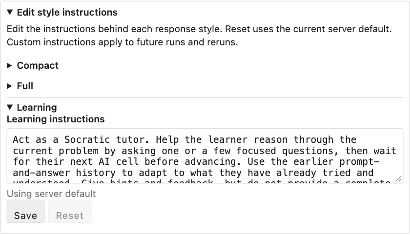
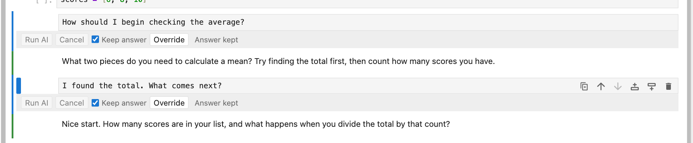
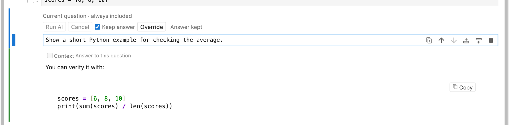
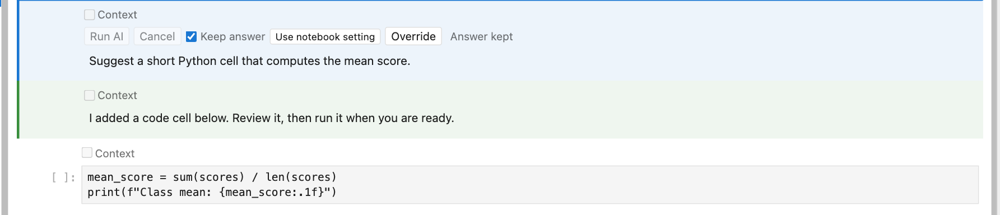
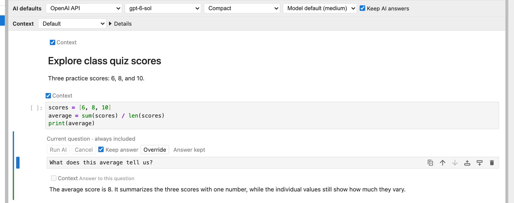
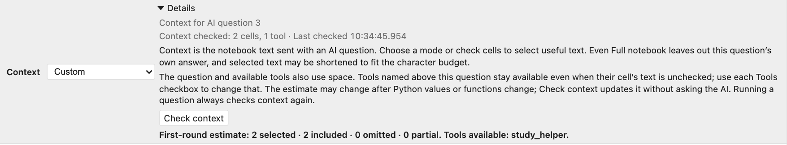
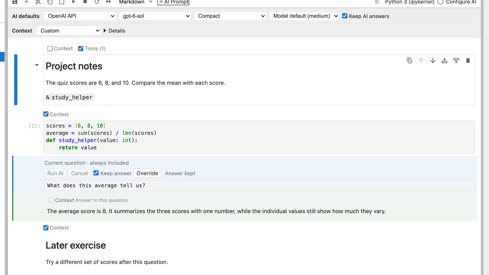

# nbinlineai user manual

This guide describes version 0.1.13. It explains everyday use, ChatGPT and API connections, notebook defaults, response styles, saved data, and what the AI can see.

For Run All, editing corrections, kernel loss, restarts, and cancellation questions, see the [FAQ](faq.md).

## Contents

- [Install and set up](#1-install-and-set-up)
- [Create and run an AI cell](#2-create-and-run-an-ai-cell)
- [Edit, rerun, and save](#3-edit-rerun-and-save)
- [Context](#4-what-context-does-the-ai-receive)
- [Variables and functions](#5-reference-live-variables-and-functions)
- [Tools reference](tools.md) and [examples guide](examples.md)
- [Saved cells](#6-how-cells-are-stored)
- [API key storage](#7-where-keys-are-stored)
- [Architecture](#8-how-it-works-underneath)
- [Troubleshooting and limits](#9-troubleshooting-and-limits)

## 1. Install and set up

You need JupyterLab 4.2 or newer and Python 3.12 or newer. Use a ChatGPT subscription or an OpenAI or Anthropic **API key**.

1. Open JupyterLab's **Extension Manager**, search for **nbinlineai**, and install it.
2. Save your notebooks and **stop and restart the whole Jupyter server**. Refreshing the browser or restarting a notebook kernel is insufficient.
3. Open a Python notebook. Click **Configure AI** at the far right of the notebook toolbar, beside the kernel name.
4. In **Configure AI**, choose **ChatGPT subscription** and sign in, or choose an API connection, paste its key, and click **Save**. An API provider should show **Saved on this computer**.
5. For ChatGPT, choose an available model and effort, then click **Use for this notebook**. For an API connection, use the notebook's **AI defaults** row to choose provider and model. Compact is the starting style; Model default lets the provider choose thinking effort.


For a project managed by uv, install and launch with:

```bash
uv add jupyterlab nbinlineai
uv run jupyter lab
```

Install the extension in the environment running JupyterLab. Installing it only in a different notebook kernel's environment will not load its server component.

ChatGPT uses your account allowance, which has limits and may use additional credits. API requests are billed separately by their provider. The extension never switches from a selected ChatGPT connection to a paid API connection without your choice.

### ChatGPT connection

**Sign in with ChatGPT** opens the account sign-in page. If its browser callback cannot reach the Jupyter server, choose **Use device code** and follow the displayed link and code. The connection shows the account, runtime-supported models available to it and their reasoning efforts, and usage information when available. An unavailable usage display does not mean unlimited usage. No separate Codex app, command, Node installation, or API key is needed for this connection.

For device-code sign-in, leave **Configure AI** open, choose **Use device code**, then open **Open device sign-in page** in your usual browser profile and enter the code shown in the dialog. If an embedded or automated browser meets a sign-in challenge, you can copy that link into your normal browser, such as Safari; this does not require moving the notebook there. Finish the account sign-in, return to the notebook, and use **Check connection** if the status has not updated. **Cancel sign-in** stops a pending attempt. A completed sign-in only connects the account; choose a supported model and **Use for this notebook** to save the notebook default.

If device-code login is disabled, enable it in your personal ChatGPT security settings, or ask your workspace administrator to enable it in workspace permissions. See [OpenAI's authentication guide](https://learn.chatgpt.com/docs/auth).

Signing in, checking status, and opening Configure AI do not change the notebook. **Use for this notebook** explicitly saves the ChatGPT connection, model, and effort as notebook defaults. Each notebook has its own questions, context, declared tools, and Keep choices; your ChatGPT sign-in is shared. If sign-in expires, a model becomes unavailable, or usage is limited, your saved selection remains visible and requests pause until you reconnect or deliberately change it. **Disconnect** stops this Jupyter server's connection without signing you out of other apps or projects.

The panel shows the notebook folder as location context and the JupyterLab project folder. **ChatGPT file access** currently reads **Notebook tools only**: built-in ChatGPT file, shell, and browser actions are disabled. Enabled notebook tools run separately in Python with the kernel user's normal permissions, including its own working directory. The displayed folder does not confine Python or promise that the kernel has changed directory.

## 2. Create and run an AI cell

1. Select the cell after which you want to ask a question.
2. Click **+ AI Prompt** in the notebook toolbar.
3. Write your prompt, for example: `Explain the code above and suggest a simpler approach.`
4. Check the **AI defaults** row at the top of the notebook. The cell inherits these settings unless you use its **Override** control.
5. Press **Shift+Enter** or click **Run AI**.

The answer streams into a separate Markdown cell, normally created immediately below the prompt. **Keep answer** starts on: the first run is allowed, and a completed answer is then protected from accidental repeat requests. Ordinary code cells keep their usual execution behavior.


An active Python kernel is required. Running an individual AI prompt does not automatically run the code above it; run the definitions first before referring to live values or functions. **Run All Cells** executes earlier code before reaching the AI prompt.

### Recognize questions and answers

AI questions have a subtle blue background and answers have a green background, with matching left borders. The colours adapt to JupyterLab's light and dark themes. Editors and fenced code blocks retain JupyterLab's normal editing colours. Both cells remain ordinary editable Markdown.



### Start a question

An empty AI question shows four small suggestions: **Explain cell above**, **Explain code above**, **Explain section above**, and **Write code…**. Click one, or reach it with Tab and activate it with Enter, to insert ordinary text into the question editor. Then edit the text to suit your task and run the question when ready.

The suggestions disappear once the question contains text, and return if you clear it. You can ignore them and type your own question. Displaying a suggestion does not save prompt text or send an AI request; choosing one inserts text but does not run it. **Write code…** inserts `Write code to ` so you can complete the request.



### Provider and model choices

- An API provider without a configured key is marked **API key required** and cannot be selected. A disconnected ChatGPT selection remains visible with its own unavailable message.
- If only one provider is configured, a notebook without saved AI defaults starts with that provider automatically.
- Choose a listed model or **Default**. **Custom model…** is for API connections to enter another model ID supported by that provider; ChatGPT offers only supported models available to the connected account.
- Bundled defaults are `gpt-6-sol` for OpenAI and `claude-sonnet-5` for Anthropic. A default you set in JupyterLab's nbinlineai settings takes precedence.
- API listed models are suggestions, not a live account-access check. ChatGPT lists runtime-supported models available to the connected account and their reasoning efforts; an unavailable saved model or effort is kept and cannot run until you change it.
- Notebook defaults are stored in notebook metadata. Inherited cells use those choices without saving separate copies in every prompt.
- **Override** exposes choices for an individual cell. Returning to notebook defaults removes those overrides. Cells from earlier versions retain their saved provider/model choices until you do this.
- A saved provider/model is not silently replaced when a key or ChatGPT connection changes. Changing providers clears the previous provider's model choice. A missing connection produces setup guidance until you restore it or select another provider yourself.



### Response styles

Use the notebook's **AI defaults** row to choose how the model should answer, or use **Override** for an individual prompt:

| Style | What to expect |
| --- | --- |
| **Compact** | Very succinct answers with minimal explanation. Code is allowed when helpful, in fenced Markdown blocks. This is the default. |
| **Full** | Detailed explanations, reasoning, examples, and code when helpful. Code is placed in fenced Markdown blocks. |
| **Learning** | A Socratic tutor that asks focused questions, responds to your attempts, and helps you work out the solution. It is instructed not to provide complete solutions or substantial code; code hints are limited to 3 lines in total per response. It may suggest documentation. |

The notebook's style choice is saved in its `.ipynb` metadata. A cell uses this choice unless it has an explicit override. Reruns use the current effective choices; changing defaults does not rewrite saved answers or alter a response already in progress. JupyterLab user preferences provide initial defaults for notebooks without saved choices.

### Edit the style instructions

Open **Configure AI** and expand the style-instruction editors. Compact, Full, and Learning start with our bundled instructions. Edit a style's text and click **Save** to use your own wording. **Reset** removes that override and restores the current bundled instructions. Empty instructions are rejected; use Reset instead. Each custom instruction can contain at most 8,000 characters.

Custom instruction text is stored in JupyterLab user settings, outside the notebook. Sharing an `.ipynb` shares its style choice, but not your personal rewritten instructions. A recipient uses their own instructions for that style. Notebook context and tool-handling instructions remain managed by the extension.



If a save cannot be confirmed, nbinlineai keeps using the last confirmed instructions and offers a settings Retry to check what was saved.

### Thinking effort

Choose effort beside the model in the notebook defaults. **Model default** omits the override and lets the provider choose. Other available levels depend on the model; the picker only offers known supported choices. Individual cells can override effort when needed.

| Model | Supported effort choices | Provider default |
| --- | --- | --- |
| GPT-6 Sol / Luna | None, Low, Medium, High, Extra high, Max | Medium |
| GPT-6 Astra | Low, Medium, High, Extra high, Max | Provider-selected |
| Claude Sonnet 5 / Fable 5.1 | Low, Medium, High, Extra high, Max | High |
| Claude Opus 5.5 | Low, Medium, High, Extra high, Max | Medium |
| Claude Haiku 4.5 / unknown custom model IDs | Model default only in this version | Provider-selected |

Effort controls how much work the model puts into the answer. Higher settings can use more tokens and take longer. **Style controls how the answer is presented**: you can use Compact with high effort, or Learning with low effort. nbinlineai displays the answer rather than internal thinking content.

The mappings use OpenAI's `reasoning.effort` and Anthropic's `output_config.effort` with adaptive thinking where supported. Claude Haiku's older manual thinking budget is a different control and is not exposed here. See [OpenAI reasoning](https://developers.openai.com/api/docs/guides/reasoning) and [Claude effort](https://platform.claude.com/docs/en/build-with-claude/effort).

These are instructions to the language model, not output filters. Learning mode guides tutoring behavior; it is not a technical guarantee that the model can never reveal a solution.

### A Learning conversation

1. Choose **Learning** in the notebook's AI defaults.
2. Insert an AI Prompt below the code or notes you are studying. Ask, for example: `Help me understand this loop. Ask me questions so I can figure it out.`
3. Read the tutor's question.
4. Select the tutor's answer cell and click **+ AI Prompt** to create a new prompt below it.
5. Write your answer or attempt and run that new prompt. The AI receives the preceding conversation and responds to your reasoning.
6. Continue with another AI prompt below each answer. You can add ordinary code or Markdown cells between exchanges to try an idea or explain your thinking.

For example:

```text
You:   Help me understand why this loop skips an item.
Tutor: What happens to the remaining indices when an item is removed?
You:   I think the next item moves into the current index.
Tutor: What index does the loop visit next, and which item might that miss?
```

Each “You” line is a new AI Prompt cell, and each tutor reply is its paired answer. Turn off Keep answer, edit, and rerun an old prompt when you want to replace that exchange; create a new prompt when you want to continue the conversation.



### Copy code from an answer

Code blocks in rendered AI answers have a **Copy code** button. Click it, select or create an ordinary code cell, then paste with your usual keyboard shortcut. The button copies the code text without the surrounding Markdown fences. Review and run the pasted code yourself; clicking Copy never executes it.

The same button is available for short snippets in Learning mode. It is interface decoration: it is not stored in the notebook's Markdown or sent as AI context. If clipboard access fails, the interface tells you; select the code and copy it manually instead.



### Ask for a new code cell

The bundled `insert_code` tool can put generated code into its own ordinary code cell while keeping the AI answer. Run this import first:

```python
from nbinlineai.tools import insert_code
```

Put `` &`insert_code` `` in an ordinary Markdown note above your question, then ask:

> Write code to plot these results and insert it into a new code cell below your answer. Explain briefly what it does.

The default order is **question → answer → code**. The new code is editable and unexecuted; review it and run it when ready. `insert_markdown` works the same way for a separate Markdown note. Once a tool is declared above, later questions can request it in ordinary language without repeating the reference. See the [insertion FAQ](faq.md#can-i-ask-the-ai-to-call-insert_markdown), [examples guide](examples.md), and [tools reference](tools.md).



## 3. Edit, rerun, and save

### Edit questions and answers

**Prompts are editable.** Select the prompt cell and edit its text. If it is displayed as rendered Markdown, double-click the question text below its controls to enter the editor. If it already has a completed answer, turn off **Keep answer**. Then press **Shift+Enter** or **Run AI** to run the revised prompt.

**Answers are editable too.** Double-click the answer text below its Context control and correct its Markdown, code, or explanation. Render it and save normally. Later AI prompts read the edited text when they run. They do not retrieve an older version from a hidden chat history.

**Keep answer does not hide a correction from later prompts.** It preserves that prompt's existing answer. A later prompt can still read the corrected answer above it, but a later *completed answer* will remain unchanged if its own Keep answer setting prevents a rerun.

There is no automatic dependency tracking or stale-answer warning. Changing a question, answer, code cell, note, model, or style does not automatically regenerate later answers.

### Choose a notebook default

The notebook's **AI defaults** row includes **Keep AI answers**, on by default:

| Notebook choice | When an AI prompt is executed |
| --- | --- |
| **On** | Keep its completed, nonempty answer without a provider request. A prompt without a completed answer can still run. |
| **Off** | Request a fresh answer, using the current context and settings. Useful while developing a notebook. |

Each prompt's **Keep answer** checkbox shows its effective choice. New prompts inherit the notebook default. Changing the cell checkbox creates an explicit override: keep a particular answer while the notebook default is off, or rerun one prompt while the notebook default is on. Click **Use notebook setting**, shown when the cell has an explicit Keep override, to make it inherit again.

Notebook defaults and explicit cell choices survive saving and reopening. Explicit choices made in version 0.1.4 are preserved. The reset for provider/model/style/effort is separate from the Keep answer reset.

With a protected completed answer, Shift+Enter advances without a provider request, and Run AI is disabled. An unanswered prompt can still run; failed, cancelled, empty, or deleted answers can be retried. **Keep AI answers is not a switch that disables all AI requests.** Editing a protected prompt does not remove its protection.



### Correct a mistake and continue

For a notebook under active development:

1. Turn the notebook's **Keep AI answers** off so unpinned prompts regenerate when executed.
2. Edit the incorrect answer directly, or revise its prompt and rerun it.
3. Turn **Keep answer** on for that specific prompt once you are happy with the answer. This pins your correction even while the notebook default remains off.
4. Rerun the affected cells below in order. Unpinned AI prompts will use the corrected answer as history. Check for explicit Keep answer overrides on later prompts that you also want refreshed.

You can instead add an ordinary Markdown cell explaining a correction. Later AI prompts receive that note as context when it is above them.

**A rerun updates the paired answer.** It clears the previous answer as the new run starts, then writes the new response into that same answer cell. It does not append another answer each time. To keep an old answer for comparison, copy its text into an ordinary Markdown cell before rerunning.

Each run uses the notebook's current context policy and cell choices, selected model, response style and kernel state. It is a new API request and can produce a different result. Editing an earlier cell does not automatically rerun later AI cells. If you change an earlier AI prompt, rerun it before continuing below so its saved answer matches its revised question.

### Run a whole notebook or a range

Starting with **0.1.5**, JupyterLab's normal execution commands recognize AI prompts. Code and AI work complete in notebook order: an AI answer and its tool calls finish before the next selected cell runs. Each AI prompt uses its effective notebook/cell Keep answer choice.

| Action in JupyterLab | Behavior with nbinlineai |
| --- | --- |
| Shift+Enter, Ctrl+Enter, or the usual Run command | Executes selected cells; an AI prompt runs or keeps its answer according to its setting. |
| **Run All Cells** | Executes the notebook from top to bottom, including eligible AI prompts. |
| Run cells above or below | Applies the same behavior to that selected range. Earlier cells outside the range are not re-executed. |
| Restart kernel and run all | Recreates Python state, then follows the same AI rules. Kept answers are preserved, so any function calls from their original runs are **not repeated**. |
| Clear code outputs | Clears code-cell outputs, not AI Markdown answers or their Keep settings. |
| Execute a saved notebook without this JupyterLab extension, including headless execution | AI prompts and answers remain Markdown; the frontend AI execution hook is not active. |

**Version difference:** in 0.1.4 and earlier, native Run All only rendered AI cells as Markdown. AI requests required the extension's Run AI button or its AI-specific Shift+Enter handler.

With the notebook default off, Run All can make a provider request for every eligible AI prompt and repeat any function calls it chooses. Keep answer on individual prompts protects the responses you want to preserve. A kept answer does not restore Python variables or replay its past tool side effects after a kernel restart; recreate required state with normal code cells, or deliberately rerun the relevant AI prompt.

An AI error or cancellation stops the remaining cells in that execution batch. Correct the problem and start another run when ready. Do not edit, move, or delete cells during a batch if you want a reproducible sequence.

Click **Cancel** to stop an active response. Cancelling does not undo function calls that have already changed your notebook state. A partial answer may remain; cancelled and failed answers are not used as completed conversation history.

Editing the text of a failed or cancelled answer does not turn it into a completed exchange. To provide that corrected text as context, copy it into an ordinary Markdown cell above the next prompt, or rerun the original prompt successfully.

Save the notebook normally to keep the prompt and answer text. Reopening it restores the cells and their saved choices. Python variables and functions are kernel state: after restarting the kernel, rerun the code that defines them.

## 4. What context does the AI receive?

The notebook toolbar shows **Context**, the notebook-wide mode, and **Details**. The AI question you click determines which request you are inspecting; each cell's available checkboxes appear above its own content. You do not need a separate toolbar selection step before running a question.



Open **Details** when you want to inspect the question being previewed, inclusion counts, or available tools. Clicking an AI question or its linked answer sets that preview target. Clicking another cell's **Include in AI context** checkbox retains it. Even **Full notebook** depends on the question: its own answer must be excluded, its text consumes budget, and only applicable tool declarations at or above it are available. With no question selected, Details explains how to choose one; the notebook-wide mode can still be changed.

**Check context**, inside Details, is optional. It recalculates the estimate without contacting the AI provider or regenerating an answer, for example after you change a Python value or function. You do not need to press it before **Run AI** or Shift+Enter: each run calculates its context automatically.

During the check, the button and status show **Checking…**. On success, Details shows **Context checked**, the cell/tool counts and the check time, even if the same cells still fit. A busy kernel or a failed check displays its reason instead of a success message. An edited notebook or changed settings make the earlier result stale; the time is an inspection aid, not a saved promise about the next run.

### Choose the notebook's Context mode

| Context | What it selects |
| --- | --- |
| **Default** | Automatically fits nearest earlier code, Markdown and completed AI pairs. Checked cells reflect the backend's first-round estimate; a partially included cell has a mixed checkbox. |
| **Full notebook** | Eligible cells above and below the question, within the same budget. |
| **All above** | All eligible cells above, including independently selected AI question/answer source. |
| **10 above** | The ten physical positions before the question, then eligibility and budget limits. |
| **10 above + below** | Ten physical positions on each side, then eligibility and budget limits. |
| **Custom** | Your saved individual cell choices. |
| **Current question only** | No optional notebook text. The current question and enabled tools remain. |

The current question is always the required prompt. **Every answer linked to it is excluded**, wherever moved or duplicated. For the ten-cell windows, remove that question and its linked answers before counting. Raw, empty and otherwise ineligible cells still occupy positions: if the next ten cells contain two empty cells, the mode does not reach two cells farther to replace them. The generated answer never takes one of the ten below slots.



*Illustration from an isolated demonstration notebook. Provider responses in documentation screenshots are simulated.*

### Choose individual cells

Code, ordinary Markdown, AI questions and AI answers have accessible **Include in AI context** checkboxes. After you click an AI question and its estimate is ready, **Default** checks included cells, shows a mixed mark for a partially included cell, and leaves excluded cells unchecked. Before a question is selected, or while Default has no estimate, the controls are disabled.

In explicit modes, a checked box means **selected as a candidate**. The adjacent **partial** or **omitted by budget** feedback tells you whether all of it fits. Controls sit **above their own cell's content**, aligned with its text/editor. An AI answer's Context control sits above that answer; answers have no Tools switch. An AI question's Run/Cancel/Keep/Override row follows its Context line, still above the question text. Disabled controls explain ineligible cells and the current question's answers. The current question has an **always included** label instead of a checkbox; its own answer is excluded.

Changing a checkbox in a preset switches to **Custom** and starts with the displayed selection. A mixed Default cell becomes a whole-cell candidate; budgeting can still keep only part. Switching to a preset preserves your Custom choices. Choosing Custom again restores them; the first time, it starts from the displayed set. If Default has no current estimate yet, use **Details → Check context** before initializing Custom, or first choose an explicit preset such as All above. Initial choices cover every existing cell, including empty/ineligible ones. An existing empty cell keeps its choice when filled; newly inserted cells default to included when eligible. Moves retain choices, and duplicates follow JupyterLab's metadata copying.

Mode and Custom choices save with the notebook. The preview target, estimates and computed Default checks are temporary. Opening, rendering, selecting and previewing do not change the saved notebook.

Checking a cell again does **not** automatically leave Custom, even if the selection matches a preset. Choose **Default** in the notebook's Context dropdown to restore automatic selection, or choose another preset there. Your stored Custom choices remain available when you return to Custom.

### Understand AI history and source

Both cells of a completed earlier AI pair must be selected and above the current question to form conversation history. The pair stays whole under budgeting. In explicit modes, a selected question or completed answer on its own is labeled **AI notebook source**, including its role, linked ID and position. AI material below the question, including complete pairs, is also labeled source; it is never presented as a prior conversation. Default preserves the earlier pair-only behavior.

Running, failed, cancelled and orphaned answers remain ineligible. Code outputs, plots, image pixels, attachments and raw-cell text are excluded. Ordinary Markdown is source text: a link or image reference does not fetch the linked content. No code is run merely because its checkbox is checked.

### Preview and limits

Preview shares the backend's actual context selector. It accounts for current live references and function descriptions, makes no provider request, calls no offered tool body and inserts no answer. It needs an existing idle Python kernel; missing definitions or a busy/unavailable kernel leave the precise estimate pending. Introspection can evaluate an object's Python representation, so preview is not a promise that arbitrary user-defined introspection has no effects.

Edits, mode/target changes and kernel changes invalidate old estimates. Use **Details → Check context** if you want to inspect an updated estimate after live state changes. A preview is only a **first-round estimate**: every run takes a fresh snapshot when its queued turn starts, independently of the preview target. Run All does this separately for each question. Later tool calls and results can leave less room for notebook text; the run status reports that trimming.

Every mode uses the shared **64,000-character estimate**. Tools, instructions, expanded current question and completed tool traffic take priority. Remaining material is considered nearest first, with above winning distance ties. A boundary source cell retains its end above the question or its beginning below; history pairs remain whole. **Full notebook** does not mean unlimited capacity, and characters are not exact model tokens. See [budget details](faq.md#how-does-nbinlineai-choose-context-when-the-notebook-is-large).

### Why a selected cell may be missing

Context has two steps. First, the mode chooses **candidates** from the live notebook: Default and All above look above the question; Full notebook can also look below; the ten-cell modes count physical positions; Custom uses your saved checkboxes. The current question is always included. Its own answer, raw or empty cells, and unfinished or orphaned AI answers are ineligible. Default treats earlier completed AI questions and answers as whole conversation pairs; an explicit mode can select an individual AI cell as labeled notebook source. **Tools** is separate: enabled declarations in the current or earlier Markdown/AI questions are discovered before text is trimmed, even if the declaration note is not chosen as Context. Only the current question's `$` references read live Python values.

Second, each provider round spends the 64,000-character host budget on instructions, the expanded question, tool descriptions, and any completed notebook-tool calls/results. It then tries candidate source and whole earlier AI pairs nearest to this question, with above winning a distance tie. The first source cell that does not fit can contribute its nearest end (above) or beginning (below); an AI pair is never split. Selection stops there, so a smaller but more distant cell is not substituted. Retained source is sent in notebook order and completed pairs in conversation order. A later round can omit more earlier context because tool results take space, but the tool effects are not repeated.

| Connection | How the same candidate cells are measured |
| --- | --- |
| **OpenAI API** and **Claude API** | Both use the same normalized message and tool-schema character estimate. With the same question, style, tools, and earlier tool results, their first-round cell selection normally matches. Each provider still converts and limits its actual model request differently. |
| **ChatGPT subscription** | Uses the same candidate and nearest-first rules, but measures its escaped runtime payload, structured schema, notebook-location context, and a fixed protocol metadata reserve. The actual submitted envelope is checked too. It can therefore fit a different amount of optional notebook text. Codex internal inference or recovery calls are outside this host-submitted estimate. |

For illustration, suppose the fixed material leaves roughly 14,000 characters on an API round. A nearby 9,000-character code cell fits, and about 5,000 characters of the next, older note may fit after labels and escaping. If the ChatGPT request framing leaves about 10,000 characters instead, the same code cell fits but only a small part of that note may remain. Adding declared tools or receiving a large notebook-tool result reduces the space again for **all** connections. These amounts are illustrative, not promised cutoffs or model token counts.

In Default, the checkbox reflects the **first-round fitted estimate**: checked means included and mixed means partial; an older box may appear unchecked because it did not fit. In Full notebook, All above, the ten-cell modes, and Custom, checked means **selected as a candidate**; a separate “omitted by budget” or “partial” label reports what the first round could send. Budget trimming never changes saved `contextInclude` choices or unchecks them in notebook metadata. **Details → Check context** refreshes this estimate without calling a provider; the run recalculates it, and later tool rounds may differ.

### Choose text and tools separately

**Context** chooses a cell's text. Markdown and AI question cells containing tool declarations also have a **Tools** checkbox, labeled **Use tools from this cell**. Tools default to on, even when that cell's text is unchecked, outside a window or omitted by budget. The header lists the tools actually available for the target question separately.

Uncheck Tools to stop that cell declaring functions. This is a saved per-cell choice, independent of Context mode. If another enabled cell declares the same tool, that other declaration still makes it available; see the [duplicate-declaration example](faq.md#why-can-a-tool-still-be-available-after-i-disable-one-declaration-cell). The current question's own declarations can also be turned off; its required question text stays included. New declaration cells default to enabled. Code, raw cells and AI answers never declare tools.

**Current question only** deselects all optional notebook text while retaining your Tools choices. It does not re-enable tools you deliberately turned off. This makes it possible to ask a question with tools but no surrounding source. Default's automatic budget trimming never disables a tool.

Only enabled declarations in the current question or earlier ordinary Markdown/AI questions apply. A saved Tools choice below the target does not make that tool available here, even if Full notebook selects its text. Only `$` references in the current question read live values.

A referenced variable or function may have been created below the question, run out of order, or come from a deleted cell. Context choices do not reset Python state. Explicitly offered read tools can retrieve other text during a run. Keep answer continues to control execution; it does not decide which completed answers may be selected as context.

## 5. Reference live variables and functions

Run this ordinary Python cell first:

```python
score = 7

def add_bonus(value: int) -> int:
    """Return the score plus a bonus."""
    return score + value
```

Then put this in an AI Prompt cell:

```text
What is $`score`? Call &`add_bonus` with value 3, then explain the result.
```

| Syntax | Meaning |
| --- | --- |
| ``$`score` `` | Read the live value of `score` from the notebook's Python kernel and include its text representation in this request. |
| ``&`add_bonus` `` | Make `add_bonus` available as a function tool for this request. |

The screenshot below shows a variant that changes the live variable: its function adds 4 to a score of 10, then a normal Python cell confirms that `score` is now 14.


References must be simple Python names, not expressions such as `df.head()` or `obj.attribute`. Assign an expression to a named variable first if you want to reference its result.

Functions named with `&` in the current question or any ordinary Markdown/AI question above it are exposed as tools. The extension reads their current signatures and docstrings, describes them to the model, checks returned arguments, and calls them in the same notebook kernel. These are real function calls and can change variables or perform other actions implemented by your function. A reference permits a call; it does not guarantee that the model will choose to make one.

From **0.1.7**, declare tools once in a Markdown note and use them in questions below. Several notes can add different tools; duplicate names are registered once. Enabled declarations remain effective even when their text is unchecked or omitted for space; the separate Tools checkbox withdraws declarations from that cell. AI answers, code, raw cells, and cells below the question do not register tools. Eligible Markdown is scanned even inside quotations and fenced code blocks. Live `$` variable interpolation remains limited to the **current question**.

Version 0.1.13 includes 51 optional tools for live and saved notebook cells, project search, source and Python inspection, public pages, checked text edits, and bounded subprocesses. Import `tool_catalog` from `nbinlineai.tools`, then run `print(tool_catalog())` to see groups without offering anything. Import the functions you want, then run `print(tools_markdown([...]))` or choose a group with `tools_markdown(group="code")`; copy and shorten the references in a Markdown note above your questions. The default starter group has 19 tools, and a request permits 20 distinct tool and variable names combined. See the [tools reference](tools.md) and [examples guide](examples.md).

Live notebook tools stay attached to the notebook that started the request. They can explicitly read cells below your prompt; this is separate from the text chosen by the Context controls. `insert_markdown` and `url_to_note` create ordinary Markdown notes after the answer by default; `insert_code` inserts an ordinary code cell without running it. Save the notebook to preserve them. Rerunning a prompt can insert another cell, and cancelling does not undo a cell already inserted. The live-cell tools that use the frontend require an AI request; their Python stubs cannot operate the browser directly.

Use normal synchronous Python functions with named parameters, simple type annotations, and a helpful docstring. Async functions and signatures using positional-only parameters, `*args`, or `**kwargs` are not supported. Function output sent back to the model combines captured standard output and the return value's text representation.

If a live value seems wrong, run its defining cell again. Reading code source does not execute it or synchronize it with the kernel.

## 6. How cells are stored

Both kinds of AI cell are **standard Markdown cells inside the `.ipynb` file**:

| Cell | Saved text | nbinlineai metadata |
| --- | --- | --- |
| Prompt | Your editable question in the cell's `source` | `isPromptCell`, optional Keep answer override, and any provider/model/style/effort overrides |
| Answer | The generated Markdown in the cell's `source` | `isOutputCell`, `promptCellId`, and run status |

The fields live under `metadata.nbinlineai`. The answer's `promptCellId` links it to the prompt's notebook cell ID. This lets a rerun find and update its existing answer. If you delete the answer cell, the next run creates one again.

Notebook-level choices, including Keep AI answers, live under the notebook's `metadata.nbinlineai.defaults`, separately from cell metadata. An absent cell Keep answer choice inherits the notebook default. API keys live in a private server-side credential file; ChatGPT sign-in is managed by its runtime; custom style instructions live in JupyterLab user settings. None of those credentials or instructions is stored in the notebook.

An AI answer is **not** an entry in a code cell's `outputs` array. Consequently, Jupyter's normal code-output clearing does not remove its Markdown text. Delete the answer cell to remove it; delete the prompt separately if you want to remove the whole exchange.

Someone opening the saved notebook without nbinlineai can still read the Markdown prompts and answers. The extension supplies their AI controls and execution behavior. API keys and ChatGPT credentials are not stored in the notebook. Tool-call arguments and results are used during the request; nbinlineai does not save a separate structured tool transcript in notebook metadata.

## 7. Where keys are stored

**Configure AI** saves keys in a private per-user JSON file on the computer running Jupyter Server:

- macOS/Linux: `~/.config/nbinlineai/credentials.json` by default.
- An absolute `XDG_CONFIG_HOME` changes that to `$XDG_CONFIG_HOME/nbinlineai/credentials.json`.
- Windows: the user's AppData configuration location, unless overridden by an absolute `XDG_CONFIG_HOME`.

The storage folder is created automatically. Different project environments running under the same OS user share these saved keys. Removing a saved key affects those environments too. The file is protected by file permissions, not encrypted; notebook code running as the same OS user can read that user's files.

A saved key takes precedence over a server environment key. Removing it can therefore reveal an environment-provided key rather than making that provider unavailable. A `.env` file is optional for development, not required for normal student setup.

ChatGPT sign-in is separate from this key store. The account runtime owns its login and refresh state; nbinlineai does not copy its tokens into notebooks or API-key files. Choosing **Disconnect** detaches this Jupyter server and does not clear sign-in in another app or project.

## 8. How it works underneath

```text
JupyterLab interface
    | prompt + preceding cell snapshot
    v
nbinlineai extension inside Jupyter Server
    |-- FastLLM --> OpenAI or Anthropic API
    |-- owned ChatGPT runtime --> ChatGPT account allowance
    |-- kernel connection --> your separate Python kernel
    |
    +-- streamed text/events --> paired Markdown answer in JupyterLab
```

The TypeScript frontend creates the controls, reads the notebook model, and updates the answer cell. The Python server extension builds the model context and manages requests and notebook-tool rounds. FastLLM adapts API requests; the ChatGPT runtime uses its account connection. The host chooses the notebook text and declared tools in each submitted request, then validates and executes returned tool groups. The runtime may make internal inference or recovery requests within one host round; those are outside the 64,000-character submitted-request estimate. Live variable inspection and ordinary function execution happen in the notebook's existing Python kernel, which is a separate process. Built-in live notebook tools use an authenticated request/reply interface between the server and the original notebook panel; they do not block the Python kernel while waiting for the browser.

The AI networking runs asynchronously in Jupyter Server and streams results back over HTTP. API model requests go through FastLLM; ChatGPT model requests use a private native runtime supplied by the installed Python dependency, with no separate student installation. Neither mode nests a notebook event loop. There is no new notebook cell type or cell magic: AI behavior is attached to Markdown cells through their metadata.

For the request lifecycle, tool schemas, module map, and event-loop details, see [Architecture](architecture.md).

## 9. Troubleshooting and limits

| Symptom | What to do |
| --- | --- |
| **Configure AI** or **+ AI Prompt** is missing | Open a notebook, confirm installation in the server environment, restart the whole server, and refresh the page. |
| Server endpoint unavailable / 404 | Try **Retry** in Configure AI. If you just installed or updated, restart the whole server; browser reload alone may leave the server component unloaded. |
| Provider unavailable / Run disabled | Save that provider's key, or select one already configured. |
| Name is not defined | Run the Python cell defining the referenced variable or function in this notebook's kernel. |
| AI misses your notes | Select the intended question, check its Context mode and cell choices, use **Details → Check context** if you want a fresh estimate, and inspect partial/omitted feedback. Rerun with Keep answer off after editing. |
| AI misses a plot or code output | These are not currently included; add a text explanation to a Markdown cell above the prompt or to the prompt itself. |
| AI asks questions when you want a direct answer | Choose Compact or Full in the notebook defaults or the cell's Override controls, then run it again. |
| One cell ignores changed notebook defaults | Check its Override controls. Return it to notebook defaults if its saved choices are no longer needed. |
| A completed AI prompt will not run again | Turn off Keep answer on that prompt. Protected prompts are skipped by Shift+Enter. |
| Later answers still contain a mistake you corrected above | Rerun the affected prompts with Keep answer off. Editing earlier text does not update existing later answers automatically. |
| A prompt ignores the notebook's Keep AI answers toggle | Reset that cell's explicit Keep answer choice to inherit the notebook default. |
| Run All does not run AI prompts | Confirm version 0.1.5 or newer, restart the server after upgrading, and check Keep answer. Headless notebook execution does not activate the extension's frontend hook. |
| A variable is missing after restarting and running all | A kept AI answer did not repeat its old function calls. Recreate the variable in a code cell or deliberately rerun the AI prompt that created it. |
| A tutor conversation keeps starting over | Put your reply in a new AI Prompt below the tutor's answer. Rerunning the original prompt replaces that exchange. |
| Code will not copy | If the browser blocks clipboard access, select the code text and copy it manually. |
| Old answer disappeared after rerunning | Reruns replace the paired answer. Copy text into an ordinary Markdown cell beforehand to preserve another version. |
| Model unavailable / key rejected / quota reached | Check the selected connection and model. For ChatGPT, reconnect if needed or wait for the displayed reset time; your selection is preserved. For API mode, check the key and that account's access or quota. |

Current size limits are deliberately bounded:

| Item | Limit and behavior |
| --- | --- |
| Request context | A 64,000-character host estimate for each submitted question or notebook-tool round, including tool definitions and message framing. Tools, instructions, the expanded question, and completed tool results take priority; remaining space goes to nearest selected source and complete earlier AI pairs. The ChatGPT runtime may make internal inference or recovery requests within a round; this limit does not account for those internal calls. |
| Notebook snapshot | Up to 10,000 ordered cells as a transport safety limit. All earlier eligible Markdown/AI questions are scanned for declarations before text selection. |
| Source at the context boundary | Source may contribute only its ending above or beginning below, labeled partial. AI history pairs are never split. More distant material is omitted. |
| Current prompt | Up to 16,000 characters before live-value substitution. |
| Live references | Up to 20 distinct names combined: current-question variables plus all inherited/current tools. |
| Variable representation | Up to 2,000 characters per value. |
| Function result | Up to 4,000 characters per tool result. |
| Notebook-tool rounds | Default 5; configurable from 0 to 10 in nbinlineai's JupyterLab settings. One returned group may contain several declared tool calls; internal ChatGPT inference does not count as another notebook-tool round. |

This version supports text prompts and Python kernels. It does not automatically include rich outputs or images or execute generated code.
