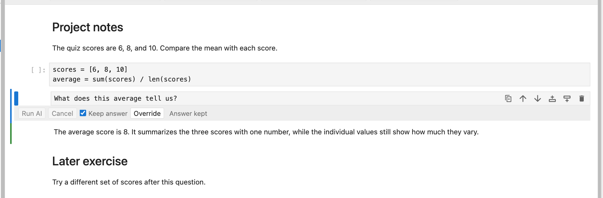

# nbinlineai user manual

This guide describes nbinlineai 0.1.5. It explains everyday use, notebook defaults, response styles, what is saved in your notebook, and exactly what the AI can see. Version 0.1.5 adds a notebook-wide Keep AI answers default and integrates AI prompts with JupyterLab's normal notebook execution commands.

For Run All, editing corrections, kernel loss, restarts, and cancellation questions, see the [FAQ](faq.md).

## Contents

- [Install and set up](#1-install-and-set-up)
- [Create and run an AI cell](#2-create-and-run-an-ai-cell)
- [Edit, rerun, and save](#3-edit-rerun-and-save)
- [Context](#4-what-context-does-the-ai-receive)
- [Variables and functions](#5-reference-live-variables-and-functions)
- [Saved cells](#6-how-cells-are-stored)
- [API key storage](#7-where-keys-are-stored)
- [Architecture](#8-how-it-works-underneath)
- [Troubleshooting and limits](#9-troubleshooting-and-limits)

## 1. Install and set up

You need JupyterLab 4.2 or newer, Python 3.11 or newer, and an OpenAI or Anthropic **API key**.

1. Open JupyterLab's **Extension Manager**, search for **nbinlineai**, and install it.
2. Save your notebooks and **stop and restart the whole Jupyter server**. Refreshing the browser or restarting a notebook kernel is insufficient.
3. Open a Python notebook. Click **Configure AI** at the far right of the notebook toolbar, beside the kernel name.
4. Paste your key into its provider's password field and click **Save**. The provider should show **Saved on this computer**.
5. Use the notebook's **AI defaults** row to choose provider, model, style, and effort. Compact is the starting style; Model default lets the provider choose thinking effort.


For a project managed by uv, install and launch with:

```bash
uv add jupyterlab nbinlineai
uv run jupyter lab
```

Install the extension in the environment running JupyterLab. Installing it only in a different notebook kernel's environment will not load its server component.

API usage is billed by your provider. ChatGPT subscription sign-in is not supported in this version.

## 2. Create and run an AI cell

1. Select the cell after which you want to ask a question.
2. Click **+ AI Prompt** in the notebook toolbar.
3. Write your prompt, for example: `Explain the code above and suggest a simpler approach.`
4. Check the **AI defaults** row at the top of the notebook. The cell inherits these settings unless you use its **Override** control.
5. Press **Shift+Enter** or click **Run AI**.

The answer streams into a separate Markdown cell, normally created immediately below the prompt. **Keep answer** starts on: the first run is allowed, and a completed answer is then protected from accidental repeat requests. Ordinary code cells keep their usual execution behavior.


An active Python kernel is required. Running an individual AI prompt does not automatically run the code above it; run the definitions first before referring to live values or functions. **Run All Cells** executes earlier code before reaching the AI prompt.

### Provider and model choices

- A provider without a configured key is marked **API key required** and cannot be selected.
- If only one provider is configured, a notebook without saved AI defaults starts with that provider automatically.
- Choose a listed model, **Default**, or **Custom model…** to enter another model ID.
- Bundled defaults are `gpt-6-sol` for OpenAI and `claude-sonnet-5` for Anthropic. A default you set in JupyterLab's nbinlineai settings takes precedence.
- Listed models are suggestions, not a live account-access check. Your API account must have access to the chosen model.
- Notebook defaults are stored in notebook metadata. Inherited cells use those choices without saving separate copies in every prompt.
- **Override** exposes choices for an individual cell. Returning to notebook defaults removes those overrides. Cells from earlier versions retain their saved provider/model choices until you do this.
- A saved provider/model is not silently replaced when you add or remove a key. Changing providers clears the previous provider's model choice. A missing provider key produces setup guidance until you add the key or select an available provider.


### Response styles

Use the notebook's **AI defaults** row to choose how the model should answer, or use **Override** for an individual prompt:

| Style | What to expect |
| --- | --- |
| **Compact** | Very succinct answers with minimal explanation. Code is allowed when helpful, in fenced Markdown blocks. This is the default. |
| **Full** | Detailed explanations, reasoning, examples, and code when helpful. Code is placed in fenced Markdown blocks. |
| **Learning** | A Socratic tutor that asks focused questions, responds to your attempts, and helps you work out the solution. It is instructed not to provide complete solutions or substantial code; code hints are limited to 3 lines in total per response. It may suggest documentation. |

The notebook's style choice is saved in its `.ipynb` metadata. A cell uses this choice unless it has an explicit override. Reruns use the current effective choices; changing defaults does not rewrite saved answers or alter a response already in progress. JupyterLab user preferences provide initial defaults for notebooks without saved choices.

### Edit the style instructions

Open **Configure AI** and expand the style-instruction editors. Compact, Full, and Learning start with our bundled instructions. Edit a style's text and click **Save** to use your own wording. **Reset** removes that override and restores the current bundled instructions. Empty instructions are rejected; use Reset instead. Each custom instruction can contain at most 8,000 characters.

Custom instruction text is stored in JupyterLab user settings, outside the notebook. Sharing an `.ipynb` shares its style choice, but not your personal rewritten instructions. A recipient uses their own instructions for that style. Notebook context and tool-handling instructions remain managed by the extension.


If a save cannot be confirmed, nbinlineai keeps using the last confirmed instructions and offers a settings Retry to check what was saved.

### Thinking effort

Choose effort beside the model in the notebook defaults. **Model default** omits the override and lets the provider choose. Other available levels depend on the model; the picker only offers known supported choices. Individual cells can override effort when needed.

| Model | Supported effort choices | Provider default |
| --- | --- | --- |
| GPT-6 Sol / Luna | None, Low, Medium, High, Extra high, Max | Medium |
| GPT-6 Astra | Low, Medium, High, Extra high, Max | Provider-selected |
| Claude Sonnet 5 / Fable 5.1 | Low, Medium, High, Extra high, Max | High |
| Claude Opus 5.5 | Low, Medium, High, Extra high, Max | Medium |
| Claude Haiku 4.5 / unknown custom model IDs | Model default only in this version | Provider-selected |

Effort controls how much work the model puts into the answer. Higher settings can use more tokens and take longer. **Style controls how the answer is presented**: you can use Compact with high effort, or Learning with low effort. nbinlineai displays the answer rather than internal thinking content.

The mappings use OpenAI's `reasoning.effort` and Anthropic's `output_config.effort` with adaptive thinking where supported. Claude Haiku's older manual thinking budget is a different control and is not exposed here. See [OpenAI reasoning](https://developers.openai.com/api/docs/guides/reasoning) and [Claude effort](https://platform.claude.com/docs/en/build-with-claude/effort).

These are instructions to the language model, not output filters. Learning mode guides tutoring behavior; it is not a technical guarantee that the model can never reveal a solution.

### A Learning conversation

1. Choose **Learning** in the notebook's AI defaults.
2. Insert an AI Prompt below the code or notes you are studying. Ask, for example: `Help me understand this loop. Ask me questions so I can figure it out.`
3. Read the tutor's question.
4. Select the tutor's answer cell and click **+ AI Prompt** to create a new prompt below it.
5. Write your answer or attempt and run that new prompt. The AI receives the preceding conversation and responds to your reasoning.
6. Continue with another AI prompt below each answer. You can add ordinary code or Markdown cells between exchanges to try an idea or explain your thinking.

For example:

```text
You:   Help me understand why this loop skips an item.
Tutor: What happens to the remaining indices when an item is removed?
You:   I think the next item moves into the current index.
Tutor: What index does the loop visit next, and which item might that miss?
```

Each “You” line is a new AI Prompt cell, and each tutor reply is its paired answer. Turn off Keep answer, edit, and rerun an old prompt when you want to replace that exchange; create a new prompt when you want to continue the conversation.


### Copy code from an answer

Code blocks in rendered AI answers have a **Copy code** button. Click it, select or create an ordinary code cell, then paste with your usual keyboard shortcut. The button copies the code text without the surrounding Markdown fences. Review and run the pasted code yourself; clicking Copy never executes it.

The same button is available for short snippets in Learning mode. It is interface decoration: it is not stored in the notebook's Markdown or sent as AI context. If clipboard access fails, the interface tells you; select the code and copy it manually instead.


## 3. Edit, rerun, and save

### Edit questions and answers

**Prompts are editable.** Select the prompt cell and edit its text. If it is displayed as rendered Markdown, double-click it to enter the editor. If it already has a completed answer, turn off **Keep answer**. Then press **Shift+Enter** or **Run AI** to run the revised prompt.

**Answers are editable too.** Double-click a completed AI answer and correct its Markdown, code, or explanation. Render it and save normally. Later AI prompts read the edited text when they run. They do not retrieve an older version from a hidden chat history.

**Keep answer does not hide a correction from later prompts.** It preserves that prompt's existing answer. A later prompt can still read the corrected answer above it, but a later *completed answer* will remain unchanged if its own Keep answer setting prevents a rerun.

There is no automatic dependency tracking or stale-answer warning. Changing a question, answer, code cell, note, model, or style does not automatically regenerate later answers.

### Choose a notebook default

The notebook's **AI defaults** row includes **Keep AI answers**, on by default:

| Notebook choice | When an AI prompt is executed |
| --- | --- |
| **On** | Keep its completed, nonempty answer without a provider request. A prompt without a completed answer can still run. |
| **Off** | Request a fresh answer, using the current context and settings. Useful while developing a notebook. |

Each prompt's **Keep answer** checkbox shows its effective choice. New prompts inherit the notebook default. Changing the cell checkbox creates an explicit override: keep a particular answer while the notebook default is off, or rerun one prompt while the notebook default is on. Click **Use notebook setting**, shown when the cell has an explicit Keep override, to make it inherit again.

Notebook defaults and explicit cell choices survive saving and reopening. Explicit choices made in version 0.1.4 are preserved. The reset for provider/model/style/effort is separate from the Keep answer reset.

With a protected completed answer, Shift+Enter advances without a provider request, and Run AI is disabled. An unanswered prompt can still run; failed, cancelled, empty, or deleted answers can be retried. **Keep AI answers is not a switch that disables all AI requests.** Editing a protected prompt does not remove its protection.


### Correct a mistake and continue

For a notebook under active development:

1. Turn the notebook's **Keep AI answers** off so unpinned prompts regenerate when executed.
2. Edit the incorrect answer directly, or revise its prompt and rerun it.
3. Turn **Keep answer** on for that specific prompt once you are happy with the answer. This pins your correction even while the notebook default remains off.
4. Rerun the affected cells below in order. Unpinned AI prompts will use the corrected answer as history. Check for explicit Keep answer overrides on later prompts that you also want refreshed.

You can instead add an ordinary Markdown cell explaining a correction. Later AI prompts receive that note as context when it is above them.

**A rerun updates the paired answer.** It clears the previous answer as the new run starts, then writes the new response into that same answer cell. It does not append another answer each time. To keep an old answer for comparison, copy its text into an ordinary Markdown cell before rerunning.

Each run uses the notebook's current preceding code and Markdown notes, available earlier AI conversations, selected model, current response style, and current kernel state. It is a new API request and can produce a different result. Editing an earlier cell does not automatically rerun later AI cells. If you change an earlier AI prompt, rerun it before continuing below so its saved answer matches its revised question.

### Run a whole notebook or a range

Starting with **0.1.5**, JupyterLab's normal execution commands recognize AI prompts. Code and AI work complete in notebook order: an AI answer and its tool calls finish before the next selected cell runs. Each AI prompt uses its effective notebook/cell Keep answer choice.

| Action in JupyterLab | Behavior with nbinlineai |
| --- | --- |
| Shift+Enter, Ctrl+Enter, or the usual Run command | Executes selected cells; an AI prompt runs or keeps its answer according to its setting. |
| **Run All Cells** | Executes the notebook from top to bottom, including eligible AI prompts. |
| Run cells above or below | Applies the same behavior to that selected range. Earlier cells outside the range are not re-executed. |
| Restart kernel and run all | Recreates Python state, then follows the same AI rules. Kept answers are preserved, so any function calls from their original runs are **not repeated**. |
| Clear code outputs | Clears code-cell outputs, not AI Markdown answers or their Keep settings. |
| Execute a saved notebook without this JupyterLab extension, including headless execution | AI prompts and answers remain Markdown; the frontend AI execution hook is not active. |

**Version difference:** in 0.1.4 and earlier, native Run All only rendered AI cells as Markdown. AI requests required the extension's Run AI button or its AI-specific Shift+Enter handler.

With the notebook default off, Run All can make a provider request for every eligible AI prompt and repeat any function calls it chooses. Keep answer on individual prompts protects the responses you want to preserve. A kept answer does not restore Python variables or replay its past tool side effects after a kernel restart; recreate required state with normal code cells, or deliberately rerun the relevant AI prompt.

An AI error or cancellation stops the remaining cells in that execution batch. Correct the problem and start another run when ready. Do not edit, move, or delete cells during a batch if you want a reproducible sequence.

Click **Cancel** to stop an active response. Cancelling does not undo function calls that have already changed your notebook state. A partial answer may remain; cancelled and failed answers are not used as completed conversation history.

Editing the text of a failed or cancelled answer does not turn it into a completed exchange. To provide that corrected text as context, copy it into an ordinary Markdown cell above the next prompt, or rerun the original prompt successfully.

Save the notebook normally to keep the prompt and answer text. Reopening it restores the cells and their saved choices. Python variables and functions are kernel state: after restarting the kernel, rerun the code that defines them.

## 4. What context does the AI receive?

nbinlineai takes a snapshot when a prompt reaches its turn to execute. During Run All, this happens separately for each AI prompt, so earlier updated answers are available to later prompts. Source selection uses notebook order, not execution order.

| Information | Included? |
| --- | --- |
| The current prompt text | Yes. |
| Code cell source above the prompt | Yes, within size limits. This can include unexecuted or edited code. |
| Ordinary Markdown notes above the prompt | Yes, as source text alongside code in notebook order. This includes explanations, assignment instructions, and equations written in Markdown or LaTeX. |
| Earlier AI prompts and their completed, paired answers | Yes, when both are above the current prompt, within the history limit. |
| Raw cells above the prompt | No, currently. |
| Printed output, tracebacks, tables, plots, or images from code cells | No, currently. Include relevant text explicitly or refer to a prepared variable. |
| Cell source below the prompt | No. |
| Every variable in memory | No. Explicit `$` references retrieve selected values. |
| Files in the project folder | No automatic file reading. |

AI prompt/answer cells are also Markdown, but they enter through conversation history instead of the ordinary source context. They are not included twice. Pending, cancelled, failed, or unpaired AI exchanges are not added as ordinary Markdown notes.

For example:

```text
Markdown: lesson introduction
Code A
AI prompt 1
AI answer 1
Markdown: interpretation and next question
Code B
AI prompt 2   <- receives the notes and code above, plus the completed AI exchange
Markdown: next section   <- not included
Code C                  <- not included
```

Markdown is sent as text, including any link or image syntax. nbinlineai does not fetch linked pages, read linked files, or send the image pixels. Include the needed explanation directly in a Markdown cell or your prompt.



**Live kernel state is a separate source of information.** A referenced variable or function can have been created by a cell below the prompt, by a cell run out of order, or by code that has since been edited or deleted. The “above the prompt” boundary applies to notebook source and conversation history; it does not restrict where live Python values originally came from.

There is no separate persistent chat history: earlier conversation is reconstructed from the notebook cells on each run. Keep prompts and their answers together. Moving cells changes the context available on the next run.

## 5. Reference live variables and functions

Run this ordinary Python cell first:

```python
score = 7

def add_bonus(value: int) -> int:
    """Return the score plus a bonus."""
    return score + value
```

Then put this in an AI Prompt cell:

```text
What is $`score`? Call &`add_bonus` with value 3, then explain the result.
```

| Syntax | Meaning |
| --- | --- |
| ``$`score` `` | Read the live value of `score` from the notebook's Python kernel and include its text representation in this request. |
| ``&`add_bonus` `` | Make `add_bonus` available as a function tool for this request. |

The screenshot below shows a variant that changes the live variable: its function adds 4 to a score of 10, then a normal Python cell confirms that `score` is now 14.


References must be simple Python names, not expressions such as `df.head()` or `obj.attribute`. Assign an expression to a named variable first if you want to reference its result.

Only functions explicitly named with `&` in the current prompt are exposed as tools. The extension reads their signatures and docstrings, describes them to the model, checks returned arguments, and calls them in the same notebook kernel. These are real function calls and can change variables or perform other actions implemented by your function. A reference permits a call; it does not guarantee that the model will choose to make one.

Use normal synchronous Python functions with named parameters, simple type annotations, and a helpful docstring. Async functions and signatures using positional-only parameters, `*args`, or `**kwargs` are not supported. Function output sent back to the model combines captured standard output and the return value's text representation.

If a live value seems wrong, run its defining cell again. Reading code source does not execute it or synchronize it with the kernel.

## 6. How cells are stored

Both kinds of AI cell are **standard Markdown cells inside the `.ipynb` file**:

| Cell | Saved text | nbinlineai metadata |
| --- | --- | --- |
| Prompt | Your editable question in the cell's `source` | `isPromptCell`, optional Keep answer override, and any provider/model/style/effort overrides |
| Answer | The generated Markdown in the cell's `source` | `isOutputCell`, `promptCellId`, and run status |

The fields live under `metadata.nbinlineai`. The answer's `promptCellId` links it to the prompt's notebook cell ID. This lets a rerun find and update its existing answer. If you delete the answer cell, the next run creates one again.

Notebook-level choices, including Keep AI answers, live under the notebook's `metadata.nbinlineai.defaults`, separately from cell metadata. An absent cell Keep answer choice inherits the notebook default. API keys live in a private server-side credential file; custom style instructions live in JupyterLab user settings. Neither is stored in the notebook.

An AI answer is **not** an entry in a code cell's `outputs` array. Consequently, Jupyter's normal code-output clearing does not remove its Markdown text. Delete the answer cell to remove it; delete the prompt separately if you want to remove the whole exchange.

Someone opening the saved notebook without nbinlineai can still read the Markdown prompts and answers. The extension supplies their AI controls and execution behavior. API keys are not stored in the notebook. Tool-call arguments and results are used during the request; nbinlineai does not save a separate structured tool transcript in notebook metadata.

## 7. Where keys are stored

**Configure AI** saves keys in a private per-user JSON file on the computer running Jupyter Server:

- macOS/Linux: `~/.config/nbinlineai/credentials.json` by default.
- An absolute `XDG_CONFIG_HOME` changes that to `$XDG_CONFIG_HOME/nbinlineai/credentials.json`.
- Windows: the user's AppData configuration location, unless overridden by an absolute `XDG_CONFIG_HOME`.

The storage folder is created automatically. Different project environments running under the same OS user share these saved keys. Removing a saved key affects those environments too. The file is protected by file permissions, not encrypted; notebook code running as the same OS user can read that user's files.

A saved key takes precedence over a server environment key. Removing it can therefore reveal an environment-provided key rather than making that provider unavailable. A `.env` file is optional for development, not required for normal student setup.

## 8. How it works underneath

```text
JupyterLab interface
    | prompt + preceding cell snapshot
    v
nbinlineai extension inside Jupyter Server
    |-- FastLLM --> OpenAI or Anthropic API
    |-- kernel connection --> your separate Python kernel
    |
    +-- streamed text/events --> paired Markdown answer in JupyterLab
```

The TypeScript frontend creates the controls, reads the notebook model, and updates the answer cell. The Python server extension builds the model context, reads credentials, and manages provider requests and function-tool rounds. FastLLM adapts those requests to the providers. Live variable inspection and function execution happen in the notebook's existing Python kernel, which is a separate process.

The AI networking runs asynchronously in Jupyter Server and streams results back over HTTP. There is no extra AI daemon, nested notebook event loop, or Codex process required for this API-based version. There is also no new notebook cell type or cell magic: AI behavior is attached to Markdown cells through their metadata.

For the request lifecycle, tool schemas, module map, and event-loop details, see [Architecture](architecture.md).

## 9. Troubleshooting and limits

| Symptom | What to do |
| --- | --- |
| **Configure AI** or **+ AI Prompt** is missing | Open a notebook, confirm installation in the server environment, restart the whole server, and refresh the page. |
| Server endpoint unavailable / 404 | Try **Retry** in Configure AI. If you just installed or updated, restart the whole server; browser reload alone may leave the server component unloaded. |
| Provider unavailable / Run disabled | Save that provider's key, or select one already configured. |
| Name is not defined | Run the Python cell defining the referenced variable or function in this notebook's kernel. |
| AI misses your notes | Put the Markdown cell above the prompt, rerun the prompt after editing, and check the context size limits. Markdown source is included starting with 0.1.2. |
| AI misses a plot or code output | These are not currently included; add a text explanation to a Markdown cell above the prompt or to the prompt itself. |
| AI asks questions when you want a direct answer | Choose Compact or Full in the notebook defaults or the cell's Override controls, then run it again. |
| One cell ignores changed notebook defaults | Check its Override controls. Return it to notebook defaults if its saved choices are no longer needed. |
| A completed AI prompt will not run again | Turn off Keep answer on that prompt. Protected prompts are skipped by Shift+Enter. |
| Later answers still contain a mistake you corrected above | Rerun the affected prompts with Keep answer off. Editing earlier text does not update existing later answers automatically. |
| A prompt ignores the notebook's Keep AI answers toggle | Reset that cell's explicit Keep answer choice to inherit the notebook default. |
| Run All does not run AI prompts | Confirm version 0.1.5 or newer, restart the server after upgrading, and check Keep answer. Headless notebook execution does not activate the extension's frontend hook. |
| A variable is missing after restarting and running all | A kept AI answer did not repeat its old function calls. Recreate the variable in a code cell or deliberately rerun the AI prompt that created it. |
| A tutor conversation keeps starting over | Put your reply in a new AI Prompt below the tutor's answer. Rerunning the original prompt replaces that exchange. |
| Code will not copy | If the browser blocks clipboard access, select the code text and copy it manually. |
| Old answer disappeared after rerunning | Reruns replace the paired answer. Copy text into an ordinary Markdown cell beforehand to preserve another version. |
| Model unavailable / key rejected / quota reached | Check the selected provider and model, then the key and account's API access or quota. |

Current size limits are deliberately bounded:

| Item | Limit and behavior |
| --- | --- |
| Preceding cells | More than 200 preceding cells rejects the request; this count includes all cell types. |
| Code and ordinary Markdown source | A combined limit of 50,000 source characters, collected in notebook order from the top downward; excess source is omitted. AI exchanges use the separate history budget. |
| Conversation history | Up to 16,000 characters across complete prompt/answer pairs, starting with the newest pair and stopping when the next pair does not fit. |
| Current prompt | Up to 16,000 characters before live-value substitution. |
| Live references | Up to 20 distinct variable/function names per prompt. |
| Variable representation | Up to 2,000 characters per value. |
| Function result | Up to 4,000 characters per tool result. |
| Tool rounds | Default 5; configurable from 0 to 10 in nbinlineai's JupyterLab settings. |

This version supports text prompts and Python kernels. It does not automatically include rich outputs or images, execute generated code, or provide ChatGPT subscription sign-in.
