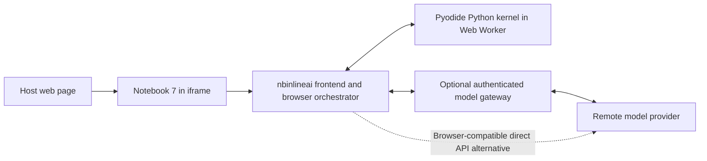

# JupyterLite feasibility for nbinlineai

**Research date:** 2026-09-25. **Status:** exploration, not an implemented port.

This study uses `main` at `4064456869ca292b81c06b79fc8168f7a3f0bc89`
(nbinlineai 0.1.15). The user selected `main` for this exploration. It changes
research documentation only; PyPI and runtime behavior are unchanged.

## Findings

**JupyterLite distributions can include extensions. Our published frontend
loads in JupyterLite, including its Notebook interface. Our AI functionality
does not currently work there without a port.**

An isolated build with JupyterLite 0.8.4 and nbinlineai 0.1.15 loaded the
**AI Prompt**, **Configure AI**, notebook defaults, and context controls in both
Notebook and Lab. The frontend requested `/nbinlineai/status`, which returned
HTTP 404: a static JupyterLite site has no nbinlineai Python server handler.
This is a demonstrated frontend-loading result, not a successful AI session.

The proposed product is feasible enough to justify a focused prototype:
**embed the Notebook 7 interface, execute notebook Python in a browser WASM
kernel, and give nbinlineai a browser-compatible model and tool orchestration
path.** Most of the notebook UI need not be reinvented. The server dependency
is substantial enough that this is more than changing packaging.

WASM applies to the Python interpreter and compatible compiled packages. The
frontend remains JavaScript. Moving notebook execution into the browser does
not move OpenAI/Anthropic model inference there: it would still use a network
service unless we separately implement a browser model backend.

## What JupyterLite supports

JupyterLite uses JupyterLab's prebuilt/federated extension format. A site author
installs the extensions into a build environment and runs `jupyter lite build`;
the builder includes their JavaScript, styles, and schemas in the static site.
Installing a Python package inside a running notebook is a separate operation:
it does not add that package's frontend extension to the already-built site.
See [Adding extensions](https://jupyterlite.readthedocs.io/en/stable/howto/configure/simple_extensions.html).

There is no running Python Jupyter Server in an ordinary Lite deployment.
JupyterLite replaces core server facilities with browser-side services; it does
not run arbitrary Python server-extension handlers. Upstream's
[frontend extension guide](https://jupyterlite.readthedocs.io/en/stable/howto/extensions/frontend.html)
explicitly distinguishes these mechanisms. Older documentation describing
JupyterLite “server extensions” refers to Lite's own JavaScript architecture,
not compatibility with Tornado/Jupyter Server extensions.

The builder itself can run Python and install packages on a workstation or CI
runner. That build-time environment is not the browser kernel. The fact that a
package installs on the build machine says nothing about its Python runtime
compatibility with WASM.

The release combination examined on the research date was JupyterLite **0.8.4**, based on
JupyterLab **4.6.4** and Notebook **7.6.3**; the probe uses
`jupyterlite-pyodide-kernel==0.8.6`, whose configured Pyodide version is
**314.0.6** (Python 3.14). Pin this combination for a follow-on experiment,
rather than tracking `latest`. See the
[JupyterLite release notes](https://jupyterlite.readthedocs.io/en/stable/changelog.html)
and the [kernel package](https://pypi.org/project/jupyterlite-pyodide-kernel/0.8.6/).

## Notebook interface and webpage embedding

The preferred starting interface is **Notebook 7**. It keeps a document-focused
notebook experience while using the modern extension components nbinlineai
already consumes. This is not the old Notebook 6/NbClassic extension system.
[Notebook frontend extensions](https://jupyter-notebook.readthedocs.io/en/stable/extending/frontend_extensions.html)
describes this shared extension format.

JupyterLite includes both interfaces: `/lab/` is the Lab application and
`/tree/` is the Notebook file browser. A notebook itself can be opened directly;
the local probe verified
`/notebooks/index.html?path=lite-probe.ipynb`. There is no need to show the file
browser first. See [the interface guide](https://jupyterlite.readthedocs.io/en/stable/howto/configure/interface_switcher.html).

A deployment-relative embedding example is:

```html
<iframe
  title="Interactive notebook"
  src="/lite/notebooks/index.html?path=lesson.ipynb"
  loading="lazy"
  style="width: 100%; height: 760px; border: 0"
></iframe>
```

Here `/lite/` is our own built distribution and `lesson.ipynb` is bundled
content. This example expresses the proposed delivery shape; it does not make
the current AI backend functional. We should choose the visible menus and
controls after testing the actual lesson layout.

| Interface | Suitability for this project |
| --- | --- |
| Notebook 7 in an iframe | Recommended first target: ordinary Markdown/code/AI cells, familiar notebook layout, existing components. |
| Lab in single-document mode | Useful fallback; `?mode=single-document` reduces Lab's workspace layout, but keeps Lab's application shell. |
| Lite REPL | Good for a small executable snippet; its code-console model does not directly provide nbinlineai's multi-cell document and AI metadata workflow. |
| Custom application assembled from notebook components | Possible later, but adds application integration and lifecycle work before proving the AI port. |

The [URL parameter guide](https://jupyterlite.readthedocs.io/en/stable/howto/configure/urls.html)
documents Lab's single-document mode. The
[REPL embedding guide](https://jupyterlite.readthedocs.io/en/stable/quickstart/embed-repl.html)
shows a smaller code-console embed; its minimal appearance should not be
mistaken for a drop-in host for our current notebook extension.

“Any webpage” means a page that permits an iframe and the required browser
capabilities. It does not mean a self-contained script that works regardless
of the host's restrictions. Production validation must cover:

- HTTPS, static asset paths/MIME types, worker loading, and any CDN dependencies.
- The host's frame policy and the embedded site's framing permissions.
- Browser storage and download behavior, including cross-origin/private browsing.
- Kernel filesystem synchronization. Lite can use SharedArrayBuffer with
  suitable cross-origin isolation headers, or a Service Worker fallback. Both
  the deployment and iframe context matter; isolation headers are not a blanket
  prerequisite for every Lite page.
- Explicit import/export: browser-stored notebooks are not automatically saved
  into the host website's repository or the user's local project directory.

See [filesystem synchronization](https://jupyterlite.readthedocs.io/en/stable/howto/content/python.html),
[Service Worker requirements](https://jupyterlite.readthedocs.io/en/stable/howto/configure/advanced/service-worker.html),
and [browser storage](https://jupyterlite.readthedocs.io/en/stable/howto/configure/storage.html).

For host-page buttons or passing lesson data into the iframe, upstream documents
[jupyter-iframe-commands](https://jupyterlite.readthedocs.io/en/stable/howto/configure/advanced/iframe.html).
That is an optional integration layer, not necessary for a basic embed. Any
bridge we expose should validate origins and narrowly define allowed actions;
our stable notebook/model/cell binding rules still apply.

## Where the existing extension fits

The source audit below is pinned to the commit above. File links point to the
current checkout; symbols identify the reviewed boundaries.

| Area | Current implementation | Lite assessment |
| --- | --- | --- |
| Frontend packaging | [package.json](../package.json), `jupyterlab.extension`, `sharedPackages`; [pyproject.toml](../pyproject.toml), wheel shared-data | Already a prebuilt extension. The published bundle loaded in both Lite interfaces. |
| Notebook UI | [src/index.ts](../src/index.ts), `plugin`, `executorPlugin` | Requires `INotebookTracker`/`INotebookCellExecutor`; no direct `ILabShell` dependency. Toolbar activation observed; full behavior parity remains untested. |
| Live source and edits | [src/context.ts](../src/context.ts), `notebookCells`; [src/frontendActions.ts](../src/frontendActions.ts) | Browser-owned model logic is a strong reuse candidate: unsaved cells, stable IDs, metadata, and bounded edits. |
| AI request/status/settings | [src/index.ts](../src/index.ts), `fetchStatus`, `fetchContextPreview`, `runPrompt`; [handlers.py](../nbinlineai/handlers.py) | Calls custom authenticated server routes for status, preview, prompt streaming, action replies, and credential/subscription operations. Routes do not exist on a static Lite host. |
| Kernel introspection/tools | [kernel.py](../nbinlineai/kernel.py), `KernelDispatcher` | Resolves a server session/kernel manager, opens kernel channels, and sends silent execution requests. A browser Pyodide kernel is not owned by that manager. Replace dispatch. |
| Context and AI loop | [prompt.py](../nbinlineai/prompt.py); [context_budget.py](../nbinlineai/context_budget.py) | Selection/budget rules are reusable concepts, but execution is currently server Python with FastLLM types, server dispatch, and transport coupling. Extract or port this boundary. |
| API providers and keys | [providers.py](../nbinlineai/providers.py); [credentials.py](../nbinlineai/credentials.py) | Python FastLLM and server-side credential resolution cannot simply be retained in a static frontend. Provide a browser transport or a gateway. |
| ChatGPT subscription | [subscription_runtime.py](../nbinlineai/subscription_runtime.py); [notebook_scope.py](../nbinlineai/notebook_scope.py) | Current integration launches a native App Server child and uses private host directories. It cannot execute unchanged inside browser WASM. Exclude from the initial browser-only prototype. |
| Direct `insert_tools()` | [kernel_insert_tools.py](../nbinlineai/kernel_insert_tools.py); [src/insertTools.ts](../src/insertTools.ts) | Uses execution-bound Jupyter comms, not the model SSE route. Potentially portable, but `get_parent()`, cell metadata, comm acknowledgements, and event-loop behavior need a Pyodide-specific test. |
| Bundled Python tools | [tools.py](../nbinlineai/tools.py), [fastcore_tools.py](../nbinlineai/fastcore_tools.py), [_search.py](../nbinlineai/_search.py), [execution_tools.py](../nbinlineai/execution_tools.py), [web_tools.py](../nbinlineai/web_tools.py) | Mixed portability. Browser-side live-model actions fit; some pure Python helpers may fit. Python declarations/stubs are not themselves the browser implementation. Filesystem scope changes; subprocess, shell/tmux, process-isolated search and socket-based fetch cannot be carried over unchanged. |

The wheel currently also declares JupyterLab, Jupyter Server, ipykernel,
FastLLM, and other Python dependencies. A `py3-none-any` wheel or successful
`micropip` installation does not establish that all those facilities work in
WASM. A browser-targeted helper package should avoid pulling in the server
application and native runtime dependencies.

Pyodide supports pure-Python wheels and compatible WASM binary wheels; ordinary
platform-native wheels are insufficient. Browser networking also has different
socket, CORS, and concurrency constraints. See
[package loading](https://pyodide.org/en/stable/usage/loading-packages.html),
[Python compatibility](https://pyodide.org/en/stable/usage/wasm-constraints.html),
and [browser HTTP APIs](https://pyodide.org/en/stable/usage/api/python-api/http.html).

In particular, putting our existing server behind a URL is insufficient:
its `KernelDispatcher` expects a kernel managed by that server. A remote
service cannot introspect a browser's Python namespace merely from its session
ID. Any hybrid port needs an explicit browser-to-kernel dispatch and tool-result
protocol.

## Architecture choices

These are design recommendations inferred from the audit, not implemented
capabilities.

| Choice | Where notebook Python runs | Model connection | Trade-off |
| --- | --- | --- | --- |
| Browser-only client with user-supplied API credentials | Pyodide in a browser worker | Browser calls a provider that supports the needed origin, headers, streaming, and tools | Closest to a static-only deployment. Credentials are accessible to the client; provider-specific compatibility must be verified. |
| Browser notebook plus a small model gateway | Pyodide in a browser worker | Browser calls our authenticated service; gateway calls model providers | Recommended for a public teaching/site product. Keeps service credentials off the page and allows usage limits, but introduces a backend to operate. |
| Embed server-backed Notebook 7 | Server Python kernel | Existing server AI path | A separate option when full current capabilities matter most. Does not achieve the requested browser/WASM execution; not the recommended Lite experiment. |

For a public site, use the second architecture unless a bring-your-own-key
product is an explicit requirement. A gateway does not need to run a notebook
kernel. The browser can remain responsible for context assembly and kernel/tool
execution while the gateway handles authenticated model traffic. Server-owned
keys must never be baked into static assets or a notebook.



Keeping the orchestrator outside the notebook's Python execution request avoids
asking a busy kernel to answer an introspection/tool request while it waits for
that same operation. Browser actions should apply directly to the captured live
model; Python tools should use the browser kernel's supported message interface.
The transport changes, but ordering, cancellation, identity checks, and bounded
results remain part of the product contract.

Do not promise the existing ChatGPT subscription option in the initial static
port. Our current native runtime is a hard dependency of that path. A hosted
subscription bridge would be a separate account/authentication/runtime design,
not a consequence of JupyterLite compatibility.

## Proposed next experiment

Keep the first implementation intentionally small: **one embedded Notebook 7,
one Pyodide kernel, one AI question, and one model adapter**. Start with a
deterministic browser model stub, then validate one chosen real transport as a
separate, explicitly authorized live test.

1. Extract a transport boundary from `src/index.ts` so status, preview, prompt
   events, cancellation and tool replies do not require hard-coded Python routes.
2. Reuse the live notebook model and metadata controls. Implement browser context
   assembly with parity checks against the existing selection/budget rules.
3. Add a small kernel adapter for a live `$variable` and one declared pure Python
   callable. Preserve tool discovery before context trimming and do not infer
   runtime values from notebook source.
4. Execute one live-cell read and insertion against captured IDs. Verify insertion
   acknowledgements describe the live model, not a saved notebook.
5. Exercise native Shift+Enter/Run All, Keep, cancellation, kernel restart and
   notebook replacement; verify that no effect replays during rebudgeting.
6. Test an actual iframe deployment, reload/persistence and notebook download.
   Then choose direct API/BYOK or a gateway using that site's origin and browser
   constraints. Do not expose unsupported tools as if they were available.

Acceptance would require a question using both an unsaved earlier code cell and
an actual live Python value, a streamed Markdown answer, one safe tool round,
and a round-trip `.ipynb` export with AI metadata. Preview must not mutate the
notebook. The 64,000-character host-submission bound and tool-step semantics
must remain explicit; moving the code cannot silently weaken them.

This is a proposed experiment, not a promise of feature parity or a delivery
estimate. It should produce evidence before committing to all 51 bundled tools,
subscription login, shell commands, arbitrary project files, or a custom minimal
notebook application. No implementation task or release is authorized by this
research document itself.

## Verification record

Source inspection used the main commit above and an independent read-only
`gpt-6-sol` audit (`lite_code_audit`). No product code was changed. Public package
metadata and the official documentation linked here were checked on the research
date; stable documentation URLs can change after this record.

A disposable build environment was created with `uv`, separate from the project
`.venv`. It installed `jupyterlite-core[contents]==0.8.4` and
`jupyterlite-pyodide-kernel==0.8.6`. The published `nbinlineai==0.1.15` wheel was
installed **with `--no-deps` solely to extract/test its prebuilt frontend**.
This deliberately did not install or validate the complete nbinlineai Python
runtime. The `contents` extra supplies build-time indexing support; no Jupyter
Server was started.

`jupyter lite build` copied the nbinlineai extension into the site's extension
manifest. A plain static HTTP server on `127.0.0.1:8897` served only disposable
content. Headless Chromium opened both `/notebooks/index.html?path=lite-probe.ipynb`
and `/lab/index.html?path=lite-probe.ipynb`; extension JavaScript requests returned
200, and both interfaces showed the AI toolbar/default/context controls.
Both attempted `/nbinlineai/status` and received 404, with the extension's
existing server-endpoint-unavailable message. This supports the loading verdict
and the missing-backend finding directly.

A same-origin iframe on a plain host page then opened the Notebook interface
with a correctly marked `metadata.nbinlineai.isPromptCell` question. Its AI
controls appeared. Shift+Enter executed an ordinary Python cell in the browser
and produced:

```text
42
emscripten
3.14.2
```

The AI question showed the expected unavailable-server-endpoint error. This
proves a small embedded Notebook/Pyodide/frontend combination runs; it does not
prove successful AI execution, all notebook commands, or a cross-origin embed.
The probe used headless Chromium 153.0.8010.12 only; browser coverage remains a future
check.

The static probe used no provider keys, made no model request, and used no
personal notebook data. Its owned static server was stopped after verification. Port 8888 is outside this investigation. Package
compatibility, `insert_tools()` comm behavior, full notebook execution semantics,
remote provider streaming, and cross-origin iframe deployment are not validated
by merely loading the toolbar.

This research was originally retained as an uncommitted draft on `main`.
On 2026-09-28 it was preserved in a main-based documentation topic for reviewed
integration. The original draft and probe evidence remain in the local Gest
evidence store; this update changes archival status and date-relative wording,
without rerunning the historical probe. It authorizes no runtime port, version
bump, tag, release or PyPI change. A separate task must select implementation.
